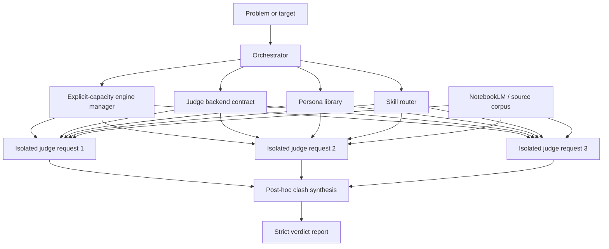

# Tribunal

Tribunal is a small MIT-licensed OSS library for hard-critical multi-judge reviews. It turns a product, repo, lane, report, or UI into a structured verdict from three unique judge personas evaluated by separate backend calls, optionally repeated with an Nx multiplier. That isolation is not automatically cross-model or cross-provider independence; a live backend must enforce and record stronger independence itself.

The local implementation is dependency-free and deterministic so it can run in CI, from a shell, or as an orchestration proof surface. Its built-in `local-rules` backend does not inspect URLs or establish the truth or quality of a target. Evidence-capable deployments inject the same small backend contract around live LLM providers, browser tools, and source corpora such as NotebookLM.

## Modes

- `knowledge`: fact and research tribunal. Prioritizes primary sources, NotebookLM, and citation gaps.
- `critique`: harsh architecture/product teardown. Prioritizes executable proof and fake-green prevention.
- `ui_ux`: interface and workflow tribunal. Prioritizes viewport proof, flow friction, accessibility, and design quality.
- `comparison`: product/library comparison tribunal. Prioritizes real links, real stars, differentiated scoring, and one crowned winner.

The three core modes are `knowledge`, `critique`, and `ui_ux`. `comparison` is an additional public-proof mode used for matrix and OSS-library comparisons.

## Hardness And Nx Multiplier

`--rounds N` requests explicit Nx rounds of isolated judge views. `--hardness` raises the minimum review pressure:

- `light`: at least 1 round
- `standard`: at least 1 round
- `hard`: at least 2 rounds
- `brutal`: at least 4 rounds

Each round still has three unique judge views. Higher hardness rotates through the available persona library. With the bundled nine personas, rounds 1 through 3 cover all nine and round 4 repeats round 1. An explicit three-person panel necessarily repeats in every later round. Nx therefore increases isolated evaluations but does not promise a new persona in every round.

## Architecture



## Backends And Engine Capacity

Every persona is evaluated through a separate `JudgeBackend.evaluate(JudgeRequest)` call. Backends return a validated `BackendResult` with a score, verdict, findings, evidence, and unresolved gaps. `evidence_gaps` may be empty only when that backend declares no unresolved proof. The bundled backend is named `local-rules`; its output explicitly says that it reviewed structure rather than target semantics.

Routed skill names are declared orchestration labels, not proof that a matching Codex skill is installed or executed. The dependency-free core records labels for a host or live backend to validate and invoke; it does not discover external skill installations itself.

Positive runtime markers require every judge to score at least 80 and every judge to return an empty evidence-gap list. A qualifying comparison receives `👑`; a qualifying knowledge, critique, or UI/UX run receives `✅`. An 80-plus average with one lower judge or any unresolved gap remains `⚠️`. This is an assertion made by the injected backend, not independent proof that its evidence is true.

Without configuration the engine manager records only `local-rules` from `builtin-local`, with no third-party quota claim. Optional integer values are judge-slot capacities, not tokens or provider promises. They can be supplied through:

- `TRIBUNAL_ENGINE_QUOTAS_JSON`
- `TRIBUNAL_ENGINE_QUOTAS_FILE`
- the `quota_json` Python argument

Configured capacity is planned one judge slot at a time and fails closed if a single Tribunal run needs more capacity than configured. Allocation is deliberately stateless across `judge()` calls because this library is not a durable billing or quota authority; callers that need cross-run enforcement must place it in the live backend or another trusted boundary.

The local score is a structural-readiness indicator, not an evidence-quality score: it assigns 10 points each for a valid target, isolated judge coordinates, a validated persona route, and a mode-specific skill route. A syntactically valid NotebookLM reference adds 10 provenance points while remaining explicitly unqueried. The local ceiling is therefore 50/100 and can never award a comparison crown.

## Persona Library

Personas live in `personas/*.json` and are validated on load, including bare HTTPS GitHub repository references and optional disclaimers preserved on the runtime `Persona` object. Current personas include multiple UI/UX specialists, research/fact-checking, security/audit, systems architecture, and a Karpathy-inspired technical critic grounded in the public repositories [llama2.c](https://github.com/karpathy/llama2.c), [minGPT](https://github.com/karpathy/minGPT), and [micrograd](https://github.com/karpathy/micrograd). The synthetic persona is neither authored nor endorsed by Andrej Karpathy and must not impersonate him or attribute generated conclusions to him.

## Installation

Install the project and its bundled persona data with a standard Python package workflow:

```bash
python -m pip install .
tribunal --help
```

## CLI Usage

Run a 2x offline comparison tribunal:

```bash
python tribunal.py \
  --mode comparison \
  --rounds 2 \
  --hardness hard \
  --target "Tribunal OSS library vs alternatives"
```

Emit JSON:

```bash
python tribunal.py --mode critique --rounds 1 --target "https://github.com/example/repo" --json
```

The CLI accepts at most 32 requested rounds and a 10,000-character target. Expected input/configuration failures return exit code 2 with a concise `tribunal: error:` message and no traceback.

## Python Usage

```python
from tribunal import BackendResult, JudgeRequest, TribunalOrchestrator, TribunalType


class EvidenceBackend:
    name = "my-live-evidence-backend"

    def evaluate(self, request: JudgeRequest) -> BackendResult:
        return BackendResult(
            verdict=f"Evidence-backed verdict for {request.persona.name}",
            score=75,
            findings=["A concrete finding from this isolated judge."],
            evidence=["A source identifier or captured observation."],
            evidence_gaps=["A specific question that remains unresolved."],
        )

tribunal = TribunalOrchestrator(
    TribunalType.COMPARISON,
    rounds=2,
    hardness="hard",
    backend=EvidenceBackend(),
)

report = tribunal.judge("Tribunal OSS library comparison")
print(report.to_markdown())
```

All isolated judge views are collected before the report creates its post-hoc synthesis. The current backend contract does not implement an interactive conversation among judges.

Markdown serialization HTML-escapes and collapses line breaks in backend-authored text while JSON preserves the original values. Treat a custom backend as untrusted code and its natural-language output as untrusted input: rendering hardening is not a prompt-injection defense for downstream agents.

## Anti-Fake Rules

- A claim without source evidence remains an evidence gap.
- A NotebookLM URL must be real; placeholders are invalid.
- A syntactically valid NotebookLM URL is a reference, not proof that its content was queried.
- The local-rules score measures review setup only and must not be presented as a substantive target verdict.
- Every positive runtime marker requires every view to score at least 80 with no declared evidence gaps; comparison uses `👑`, while the other modes use `✅`.
- Comparison CSVs must use bare GitHub URLs, numeric star counts, emoji capability cells, differentiated scores, and exactly one `👑`.
- UI/UX passes require visual or interaction evidence outside the local CLI.
- A green verdict is invalid unless the repeatable gate can be run again.

## Direct Criticism Boundary

In this project “uncensored” means direct, non-sycophantic criticism. It does not waive factual, legal, privacy, identity, or safety constraints. Evidence is never invented, real people are never impersonated, and uncertainty never becomes a fake pass.

## Gates

```bash
python examples/phase1_core_modes.py
python tribunal.py --mode comparison --rounds 2 --target "Tribunal e2e"
python -m unittest discover -s tests -v
python scripts/skill_gate.py skill/SKILL.md
python scripts/csv_gate.py report/codex-trib-lib-matrix.csv
python scripts/report_gate.py report/codex-trib-lib-tribunal.md
python -m py_compile tribunal.py scripts/csv_gate.py examples/e2e_demo.py examples/phase1_core_modes.py
```

## License

MIT. See `LICENSE`.
