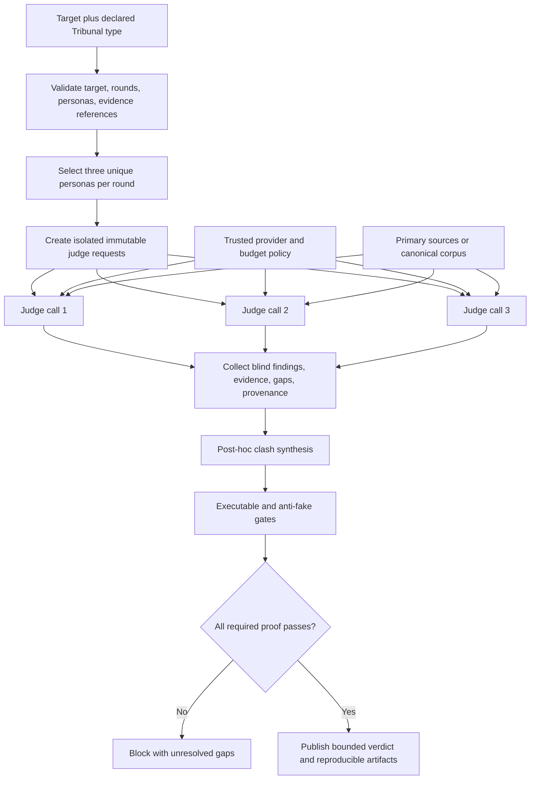

# Codex Tribunal Library: live IDR, adversarial review, and OSS verdict

## IDR

IDR: ja

Canonical public NotebookLM: https://notebooklm.google.com/notebook/80cffd38-0185-4f4d-ae00-bbc67c4bc515

The canonical notebook was verified public on 2026-07-20 with the title `Tribunal IDR 2026-07-04` and 330 sources. The retained evidence ledger records the notebook ID, source work, five cross-queries, the shared conversation ID, grounded conclusions, and a manual audit of NotebookLM overclaims.

## Method

This release used an OpenSpec-first, OSS-first sequence:

1. Specify the runtime, persona/skill, live research, comparison, and publication contracts before changing the implementation.
2. Build one canonical NotebookLM corpus from primary/project sources, relevant papers and standards, and the local code/specification artifacts.
3. Run five cross-source queries independently covering architecture/correctness, hostile risk, UX/implementability, competitor differentiation, and scoring anchors.
4. Give the same conclusion-free evidence packet to three isolated external judges. Each judge was instructed not to inspect a sibling verdict.
5. Attempt the required `grok --single -m grok-4.5 --effort high` path separately for all three perspectives. Every attempt stopped before model execution with HTTP 402, `Grok Build usage balance exhausted`. No Grok output is presented as a verdict.
6. Use the brief-authorized `agy` fallback in fresh isolated sessions: Gemini 3.1 Pro for knowledge, Claude Sonnet 4.6 for harsh criticism, and Gemini 3.5 Flash for UX. One nonresponsive UX attempt and one shell-damaged prompt were discarded and are not counted.
7. Correct external-model overclaims manually against code and executed observations. In particular, unique personas and separate calls are not represented as cross-family independence, and NotebookLM recommendations are not represented as already implemented features.
8. Query the GitHub REST API for a dated repository snapshot, score candidates with a declared 100-point rubric, and apply deterministic CSV/report/skill gates.
9. Exercise the actual library through unit tests, all three primary modes, the comparison CLI, an installed-package CLI, negative CLI behavior, compilation, and OpenSpec validation.

The three judges are independent at the session/input level: they received no sibling conclusion. Their provider families also differ across completed perspectives. The bundled library itself enforces unique persona slugs and separate backend calls only; it does not enforce cross-family routing.

## Source inventory

### Canonical research corpus

The notebook began this run with 98 sources and finished with 330. Work performed in this run included:

- 12 targeted web sources added and processed: nine project repositories, the multi-agent debate paper, NN/g usability heuristics, and W3C WCAG 2.2 guidance.
- Local `README.md`, `skill/SKILL.md`, the OpenSpec proposal/design/capability specifications, and `tribunal.py` added as research sources. The Python file was pasted as text after NotebookLM rejected the `.py` upload extension.
- 75 cited sources preserved from a prior completed deep-research result.
- A new deep-research task found 137 sources and successfully imported 133.

The targeted OSS/project sources were:

- https://github.com/promptfoo/promptfoo
- https://github.com/confident-ai/deepeval
- https://github.com/stanfordnlp/dspy
- https://github.com/langfuse/langfuse
- https://github.com/Arize-ai/phoenix
- https://github.com/microsoft/autogen
- https://github.com/vibrantlabsai/ragas
- https://github.com/openai/evals
- https://github.com/EleutherAI/lm-evaluation-harness

The research corpus also included `https://arxiv.org/abs/2305.14325`, NN/g's ten usability heuristics, and the W3C WCAG 2.2 quick reference. These are criteria sources, not proof that this CLI has a visual UI or verified usability.

### Release evidence retained in the repository

- `report/evidence/notebooklm-idr.md`: notebook identity, source/query ledger, five grounded syntheses, and manual answer audit.
- `report/evidence/grok-attempts.md`: exact failed-path status and fallback provenance.
- `report/evidence/grok-evidence-packet.md`: common inputs supplied before any synthesis.
- `report/evidence/agy-judge-knowledge.md`: complete knowledge/correctness verdict.
- `report/evidence/agy-judge-critique.md`: complete harsh-critique/risk verdict.
- `report/evidence/agy-judge-ux.md`: complete UX/implementability verdict.
- `report/evidence/github-snapshot.json`: dated stars, API SPDX values, license qualifications, and archive state.
- `report/codex-trib-lib-matrix.csv`: machine-gated score and capability matrix.

## NotebookLM cross-query synthesis

### Query 1: architecture and correctness

The corpus supports a deterministic offline layer for schemas, structural gates, stable orchestration, and explicit evidence gaps. It also supports decomposing a broad audit into correctness, risk, and UX lenses. It does not support calling three role prompts automatically independent: same-family models can share information boundaries, correlated error, style bias, position bias, and self-preference.

The minimum defensible live-judge record is provider/model identity, rubric/prompt identity, blind pre-synthesis output, citations or executable observations, unresolved gaps, and explicit bias/error-dependence controls. Factual claims require primary sources or executable constraints; UI claims require viewport and interaction observations.

### Query 2: hostile risk audit

The leading risks are correlated groupthink disguised as a panel, style/position manipulation of judge scores, fabricated traces, prompt injection in retrieved material, stance instability, runaway loops, and cost leakage. The smallest defensible controls are deterministic gates before aggregation, isolated initial results, provenance recording, pair-order swaps where comparisons are pairwise, budget enforcement at a trusted boundary, and human or executable verification for high-risk claims.

This release implements the offline boundary and gap reporting. It does not implement a cryptographic trace chain, durable execution state, live prompt-injection defense, a billing proxy, or cross-family enforcement.

### Query 3: UX and implementability

NotebookLM returned an 80/100 recommendation-oriented readiness assessment, but manual review rejected that number as an implemented-product score. The CLI is keyboard-operable, has discoverable modes, Markdown/JSON output, concise errors, explicit provenance, and installable packaging. It has no TUI or browser UI, so visual polish, responsive behavior, cognitive load, and task-completion quality cannot be established through viewport testing.

The answer also imported recommendations such as durable checkpoints and responsibility hashes as if they already existed. They do not. Only executed CLI/package observations are treated as direct UX evidence.

### Query 4: competitor differentiation

- promptfoo is the strongest production-ready declarative CLI/CI, assertion, adversarial, and red-team complement, but it is not a native three-persona Tribunal router.
- DeepEval provides strong Python/pytest evaluation metrics, but not the requested isolated panel contract.
- AutoGen is the strongest general multi-agent conversation primitive in this set, with greater runtime complexity and no native evidence-gap/crown contract.
- Langfuse and Phoenix provide strong tracing, datasets, observability, and evaluator surfaces; they are telemetry/evaluation platforms rather than this narrow orchestration layer.
- DSPy optimizes declarative LM programs and is a category mismatch for Tribunal execution.
- Ragas provides strong RAG/agent evaluation metrics without a three-persona panel.
- OpenAI Evals and lm-evaluation-harness are reproducible evaluation/benchmark runners, not interactive hard-review workflows.
- Codex Tribunal fits the requested narrow workflow directly but is immature, lacks a bundled live backend and telemetry store, and cannot guarantee model-family diversity.

The defensible composition is Tribunal for the review contract, promptfoo for adversarial regression/CI, and Langfuse or another appropriate observability layer for live traces. Composition recommendations do not imply that these projects share one license or security boundary.

### Query 5: scoring and anti-gaming

The adopted rubric rewards native type fit, blind initial judgments, bias controls, primary/executable evidence, explicit gaps, validated persona/skill routing, stable machine-readable output, and practical integration. Stars receive zero rubric points. A winner is vetoed if a deterministic gate fails, provenance is fabricated, the top score is below 70, or the recommendation hides a material category mismatch.

The manual audit also retained these caveats: the 330-source corpus contains duplicates and mixed source quality; some NotebookLM answers named sources without populating returned citation arrays; a cited external `servas-ai/tribunal` identity was not treated as this project; and private chain-of-thought is neither requested nor published. Concise rationale, inputs, outputs, citations, and tool observations provide the audit surface.

## Tribunal verdict 1: Knowledge and correctness

**Judge:** `agy` / Gemini 3.1 Pro (High)  
**Snapshot score:** 100/100  
**Recommendation:** Ship

The knowledge judge found the local/semantic boundary, license qualifications, code-to-documentation consistency, and manual NotebookLM corrections unusually strong. It explicitly confirmed three limits: the local backend cannot make substantive semantic claims, code inspection cannot prove UI/UX quality, and separate persona calls do not enforce different model families.

The perfect score is preserved as that judge's independent output, not adopted as the synthesis score. Later judges found concrete defects that the knowledge judge missed, including stateful capacity depletion, stale persona references, lost disclaimer data, raw CLI tracebacks, false brutal-rotation wording, absent package metadata, and incomplete publication artifacts at its snapshot. That disagreement is material evidence against treating any single judge as an oracle.

Evidence inspected by the judge included the shared packet, runtime, README, skill, personas, gates, tests, examples, OpenSpec, NotebookLM ledger, and live GitHub license checks. Its artifact ends with the required confirmation that it did not inspect another Tribunal verdict.

## Tribunal verdict 2: Harsh critique and risks

**Judge:** `agy` / Claude Sonnet 4.6 (Thinking)  
**Snapshot score:** 64/100  
**Recommendation:** Block at snapshot; ship only after conditions

The harsh judge correctly blocked the snapshot because the report/CSV, commit, remote, push, and blob link did not yet exist. It then found substantive implementation/documentation defects:

- `brutal` round four repeated round one with the bundled nine personas, contradicting the README; an explicit three-person panel repeats every round.
- Configured capacity was permanently decremented on a reused orchestrator.
- Eight personas used slug-like or nonexistent repository references, and the JSON `disclaimer` was dropped from the runtime object.
- The Markdown title accepted raw target HTML.
- Rounds and target size had no upper bounds.
- The local score was a skill-list-length heuristic without a defensible semantic meaning.
- “Debate” was template synthesis, not an interactive judge exchange.
- Standard Python package metadata was absent.

All release-blocking code/documentation findings were dispositioned before publication: capacity is now stateless per Tribunal run; README rotation semantics are exact; every persona reference is a validated live GitHub URL; the disclaimer survives loading; Markdown alone escapes target HTML; requests are bounded to 32 rounds and 10,000 target characters; the local 40/50-point structural calculation is transparent; synthesis is labeled post-hoc; and `pyproject.toml` packages both the module and persona JSON.

Two recommendations were deliberately bounded rather than copied blindly. The Karpathy-inspired slug remains because that requested public persona is explicitly labeled synthetic, carries public references, preserves a runtime disclaimer, forbids impersonation, and disclaims authorship/endorsement. Also, external lint/type tools are not claimed when absent; standard-library compilation and behavioral tests are the guaranteed gates.

## Tribunal verdict 3: UX and implementability

**Judge:** `agy` / Gemini 3.5 Flash (High)  
**Snapshot score:** 74/100  
**Recommendation:** Ship with conditions

The UX judge identified five practical conditions: make quota planning reusable, convert expected CLI failures to concise errors, document every CLI flag, describe “Debate” accurately, and add packaging. All five are implemented and directly tested.

The judge also noted that `JudgeRequest` contains no sibling verdict context. That is now an explicit non-capability, not a hidden defect: isolated backend calls protect blind initial views, and only post-hoc synthesis follows. A future interactive-debate contract would be a separate feature with distinct provenance and loop/budget controls.

Residual UX limits remain. There is no visual application to inspect, and target-word ranking is deterministic and sensitive to wording. Determinism helps reproduction but makes panels predictable; a live deployment that needs randomized or hidden assignments must add a recorded selection policy without sacrificing auditability.

## Debate and synthesis

The judges' 100/100, 64/100, and 74/100 scores should not be averaged into a false consensus. They covered different questions at the same pre-publication snapshot and exposed different failure classes.

### Agreements

- The standard-library core is small, coherent, and honest about the absence of semantic verification.
- A syntactically valid NotebookLM link is provenance, not proof of source access.
- Three unique personas plus separate calls are useful isolation but not cross-family independence.
- Visual UI/UX quality cannot be claimed without viewport/interaction evidence.
- The live/publication artifacts were incomplete when the external judges ran.

### Disagreements

- The knowledge judge treated code/document consistency as complete; the harsh and UX judges found concrete counterexamples. The latter findings were reproducible and therefore controlled the remediation work.
- The knowledge judge said no pre-release action was required; the critique judge blocked publication and the UX judge imposed conditions. The missing deliverables and runtime bugs make the stricter judgment correct for that snapshot.
- The UX judge described a missing interactive exchange as a limitation. The synthesis accepts the limitation but preserves blind initial judging as the current contract rather than retrofitting an unsafe conversational loop.

### Post-verdict disposition

| Finding | Disposition | Verification surface |
|---|---|---|
| Reused orchestrator exhausts plan | Fixed: capacity copied per allocation run | Repeated-`judge()` unit test |
| Raw expected CLI traceback | Fixed: concise stderr and exit 2 | Subprocess unit test and manual negative CLI run |
| Sparse CLI help | Fixed: help for every flag and limits | CLI help test |
| False brutal rotation claim | Fixed: exact nine-person and explicit-panel behavior documented | README plus 12-view brutal test |
| Invalid/stale persona references | Fixed: canonical live URLs plus boundary validation | GitHub API checks and unit test |
| Disclaimer dropped | Fixed: optional validated runtime field | Unit test |
| Markdown target injection | Fixed: Markdown-only HTML escaping | Raw dict versus Markdown unit test |
| Unbounded rounds/target | Fixed: 32 rounds and 10,000 characters | Boundary tests |
| Opaque local score | Fixed: four structural checks, optional URL provenance, 50-point ceiling | Evidence text and score tests |
| Debate overclaim | Fixed: post-hoc synthesis marker | JSON/Markdown contract test |
| No standard package | Fixed: PEP 517 metadata, console entry point, bundled JSON | Isolated virtual-environment install/E2E |
| Report, matrix, public delivery absent | Fixed by final gated artifacts and public push | Report/CSV gates and pinned blob request |

### Synthesis verdict

The core is ready to ship as an auditable offline orchestration contract and reusable skill, not as a turnkey live multi-model evaluation platform. A production live deployment still needs a backend that records actual provider/model IDs, enforces any required family diversity, applies trusted budgets, defends retrieval boundaries, and persists traces. The release is green only within that stated scope.

## 100-point rubric

The scored use case is: **a reusable, hard-critical, three-perspective review layer for knowledge/correctness, critique/risk, and UI/UX, with blind initial views, explicit evidence gaps, persona/skill routing, stable CLI/API output, and low-friction OSS reuse.**

| Dimension | Weight | High-score anchor | Anti-gaming rule |
|---|---:|---|---|
| Type Fit | 25 | Native coverage of all three review types and isolated initial panel | Generic evaluation or observability receives only partial credit |
| Adversarial Depth | 20 | Specialized judges, blind initial verdicts, bias controls, heterogeneous boundaries | Role labels alone are not independence |
| Evidence | 20 | Primary/executable evidence, citations, explicit gaps, rerunnable gates | Star counts and unsupported prose receive no evidence points |
| Extensibility | 15 | Validated/discoverable personas, reusable skills, backend/plugin seams | A generic callback without routing gets partial credit |
| Repeatability | 10 | Stable schemas, deterministic reruns, traces, pinned provenance | Screenshots or unrecorded sessions do not count |
| Integration | 10 | Small dependency/security surface and clear embedding contract | Missing integrations are not automatically a benefit |

The maximum is 100. Stars are shown only as a dated adoption snapshot and add zero points. Capability cells mean verified/native (`✅`), partial/composable (`⚠️`), or absent for this use case (`❌`). Phoenix is included as a relevant source-available comparator but is not represented as OSI open source. AutoGen and the mixed-license repositories require component-specific license review.

### Score breakdown

| Rank | Tool | Fit /25 | Adversarial /20 | Evidence /20 | Extensibility /15 | Repeatability /10 | Integration /10 | Total |
|---:|---|---:|---:|---:|---:|---:|---:|---:|
| 1 | Codex Tribunal | 25 | 13 | 18 | 15 | 7 | 7 | 85/100 |
| 2 | promptfoo | 15 | 16 | 18 | 11 | 10 | 8 | 78/100 |
| 3 | AutoGen | 18 | 16 | 10 | 14 | 7 | 5 | 70/100 |
| 4 | DeepEval | 13 | 12 | 17 | 10 | 9 | 7 | 68/100 |
| 5 | Ragas | 11 | 8 | 17 | 9 | 9 | 7 | 61/100 |
| 6 | OpenAI Evals | 10 | 7 | 17 | 8 | 10 | 7 | 59/100 |
| 7 | Langfuse | 8 | 6 | 18 | 10 | 10 | 6 | 58/100 |
| 8 | DSPy | 9 | 8 | 12 | 14 | 8 | 6 | 57/100 |
| 9 | Phoenix | 8 | 6 | 18 | 10 | 10 | 4 | 56/100 |
| 10 | lm-evaluation-harness | 7 | 5 | 18 | 7 | 10 | 6 | 53/100 |

## OSS feature matrix

GitHub metadata snapshot: `2026-07-20T15:53:55Z`. All ten repositories reported `archived=false`. Codex Tribunal had zero stars because the repository was newly created; its MIT evidence is the `LICENSE` in the delivered release. Current star counts will drift.

| Rank | Tool | GitHub repository | Stars | License qualification | Knowledge | Critique | UI/UX | Independent judges | Evidence | Persona/skill | Repeatability | Score | Result |
|---:|---|---|---:|---|:---:|:---:|:---:|:---:|:---:|:---:|:---:|---:|:---:|
| 1 | Codex Tribunal | https://github.com/Martin-Hausleitner/tribunal-public | 0 | MIT | ✅ | ✅ | ✅ | ⚠️ | ✅ | ✅ | ⚠️ | 85/100 | 👑 |
| 2 | promptfoo | https://github.com/promptfoo/promptfoo | 23,438 | MIT | ✅ | ✅ | ⚠️ | ❌ | ✅ | ⚠️ | ✅ | 78/100 |  |
| 3 | AutoGen | https://github.com/microsoft/autogen | 59,845 | CC-BY-4.0; component-specific | ⚠️ | ⚠️ | ⚠️ | ⚠️ | ⚠️ | ✅ | ⚠️ | 70/100 |  |
| 4 | DeepEval | https://github.com/confident-ai/deepeval | 16,968 | Apache-2.0 | ✅ | ⚠️ | ❌ | ❌ | ✅ | ⚠️ | ✅ | 68/100 |  |
| 5 | Ragas | https://github.com/vibrantlabsai/ragas | 14,918 | Apache-2.0 | ✅ | ⚠️ | ❌ | ❌ | ✅ | ⚠️ | ✅ | 61/100 |  |
| 6 | OpenAI Evals | https://github.com/openai/evals | 18,953 | MIT code; dataset licenses vary | ✅ | ⚠️ | ❌ | ❌ | ✅ | ⚠️ | ✅ | 59/100 |  |
| 7 | Langfuse | https://github.com/langfuse/langfuse | 31,497 | MIT except declared enterprise directories | ⚠️ | ⚠️ | ❌ | ❌ | ✅ | ⚠️ | ✅ | 58/100 |  |
| 8 | DSPy | https://github.com/stanfordnlp/dspy | 36,252 | MIT | ⚠️ | ⚠️ | ❌ | ❌ | ⚠️ | ✅ | ✅ | 57/100 |  |
| 9 | Phoenix | https://github.com/Arize-ai/phoenix | 10,641 | Elastic-2.0; source-available | ⚠️ | ⚠️ | ❌ | ❌ | ✅ | ⚠️ | ✅ | 56/100 |  |
| 10 | lm-evaluation-harness | https://github.com/EleutherAI/lm-evaluation-harness | 13,340 | MIT | ✅ | ❌ | ❌ | ❌ | ✅ | ⚠️ | ✅ | 53/100 |  |

The CSV is authoritative for machine validation and contains all component scores and unformatted numeric star values.

## Verdict and recommendation

**Winner for the declared narrow use case: Codex Tribunal, 85/100.** It wins because it directly exposes the requested three modes, three unique persona assignments per round, blind per-judge backend calls, explicit gaps, a validated Karpathy-inspired persona, a reusable skill, transparent local behavior, stable JSON/Markdown, and a zero-runtime-dependency package. Its 13/20 adversarial and 7/10 repeatability scores intentionally reflect the absence of cross-family enforcement, bias probes, a trace store, and a bundled live backend.

This is not a universal evaluation-framework ranking. promptfoo is the stronger ready-made choice for CI assertions and adversarial regression; AutoGen is the broader conversation runtime; DeepEval and Ragas are richer metric libraries; Langfuse and Phoenix are stronger observability surfaces; DSPy is stronger for program optimization; OpenAI Evals and lm-evaluation-harness are stronger established eval/benchmark runners.

The OSS-first recommendation is therefore to keep Tribunal as a thin control/evidence contract and adapt proven components instead of rebuilding them:

- Compose promptfoo when a deployment needs red-team cases, assertion catalogs, or CI regression.
- Compose Langfuse or another vetted tracing platform when persistent live telemetry is required.
- Inject a minimal provider backend instead of embedding a provider SDK into the standard-library core.
- Keep executable/test/browser checks outside judge opinion and feed observations back as evidence.

Ship this repository now for its bounded offline/library/skill scope. Do not market it as a semantic verifier, visual UX tester, cross-family consensus engine, or production observability platform.

## Implementation plan

### Delivered release

1. **Contracts:** dependency-free Python API and CLI; four modes; bounded Nx/hardness; isolated judge requests; strict backend result validation; honest local provenance.
2. **Personas and skill:** nine JSON personas, validated live GitHub references, runtime disclaimer preservation, direct-criticism boundaries, and a gated Codex `SKILL.md`.
3. **Safety and operator UX:** Markdown target escaping, clean CLI errors/help, per-run capacity semantics, explicit post-hoc synthesis, and standard packaging.
4. **Research and tribunal:** public 330-source NotebookLM corpus, five cross-queries, manual answer audit, three failed Grok paths recorded, three independent `agy` verdicts retained.
5. **Comparison and delivery:** live GitHub metadata, 100-point matrix, deterministic gates, installed-package E2E, public repository, and SHA-pinned report verification.

### Recommended next increments

1. Define a separate live-backend package that records provider, model, model version, prompt/rubric ID, latency, token/cost observations, and citations without adding those dependencies to the core.
2. Add a routing policy that can require distinct providers/model families and fail closed when provenance does not satisfy it. Call this diversity enforcement, not statistical independence.
3. Add pair-order swaps, formatting/style perturbations, calibration fixtures, and disagreement thresholds before using judge scores for high-stakes decisions.
4. Put durable budgets, retries, trace persistence, and prompt-injection controls at a trusted execution boundary.
5. If a visual product is added, test real viewports, keyboard flows, accessibility semantics, error recovery, and repeated operator tasks before scoring UI/UX.



## Limitations

- `local-rules` checks structure only. Its 40/100 score without a notebook reference and 50/100 score with one are transparent readiness markers, never target-quality judgments.
- A custom backend may send all calls to one model. Unique personas, separate requests, and different prompt lenses do not establish statistical or cross-family independence.
- Synthesis is post-hoc. Judges do not respond to sibling arguments through the current `JudgeRequest` contract.
- NotebookLM URL validation checks only HTTPS host/path syntax. Live research proof comes from the external notebook and retained ledger, not the runtime.
- The NotebookLM corpus has duplicate/mixed-quality sources, and some answers returned prose source names without populated citation arrays. Manual corrections therefore take priority over model wording.
- Grok 4.5 did not execute because the external account returned HTTP 402 on all three attempts. The completed verdicts are explicitly labeled `agy` fallbacks.
- No TUI/web UI exists. CLI execution proves operator mechanics but cannot prove visual design or browser interaction quality.
- Deterministic persona ranking is reproducible and predictable. The bundled nine personas repeat after three complete rounds; an explicit three-person panel repeats every round.
- Per-run capacity values are planning inputs, not tokens, live provider quota, or a durable billing control.
- GitHub stars are mutable adoption signals and give zero scoring points. The snapshot is not a forecast of maintenance quality.
- License labels are repository-level summaries, not legal advice. AutoGen needs component review; OpenAI Evals datasets may differ from code; Langfuse excludes declared enterprise areas from MIT; Phoenix is Elastic-2.0 source-available.
- The Karpathy-inspired critic is synthetic, neither authored nor endorsed by Andrej Karpathy, and cannot attribute generated judgments to him.

## Reproduction

Run from the repository root with Python 3.10 or newer:

```bash
python -m unittest discover -s tests -v
python -m py_compile tribunal.py personas/__init__.py scripts/csv_gate.py scripts/report_gate.py scripts/skill_gate.py tests/test_tribunal.py examples/e2e_demo.py examples/phase1_core_modes.py
python scripts/skill_gate.py skill/SKILL.md
python scripts/csv_gate.py report/codex-trib-lib-matrix.csv
python scripts/report_gate.py report/codex-trib-lib-tribunal.md
openspec validate finish-codex-tribunal-library --strict
```

Exercise every primary type and a real comparison CLI path:

```bash
python examples/phase1_core_modes.py
python tribunal.py --mode comparison --rounds 2 --hardness hard --target "Tribunal release E2E"
python tribunal.py --target "bad reference" --notebooklm-url https://example.com/notebook/id
```

Verify packaging in a clean virtual environment:

```bash
python -m venv /tmp/tribunal-release-venv
/tmp/tribunal-release-venv/bin/python -m pip install --no-build-isolation .
/tmp/tribunal-release-venv/bin/tribunal --mode knowledge --target "Installed package E2E" --json
```

Observed final gate expectations are 15 passing unit tests, successful compilation, three completed primary-mode runs, a completed comparison run, a clean installed-package JSON run, concise exit-2 behavior for the invalid NotebookLM reference, skill/CSV/report gate passes, and strict OpenSpec validation. The public handoff pins the final report URL to the delivered Git commit SHA so later branch movement cannot change the referenced evidence.
