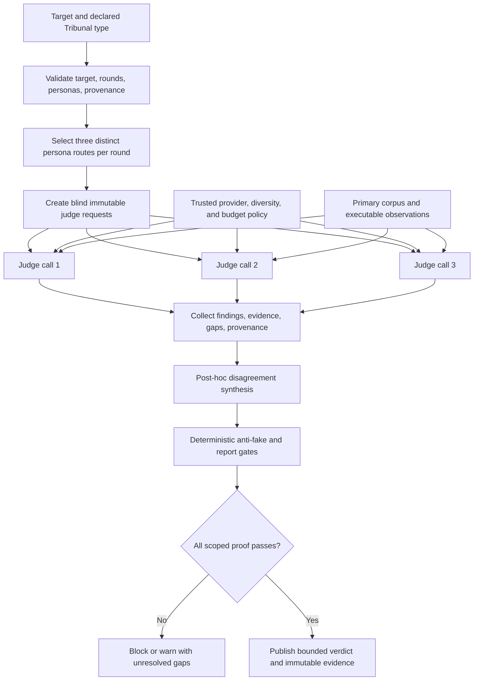

# Codex Tribunal Library: live IDR and adversarial tribunal

Audit date: `2026-07-20`

Declared use case: a reusable, hard-critical review layer for knowledge/correctness, critique/risk, and UI/UX feasibility, with blind initial views, explicit evidence gaps, a disclosed Karpathy-inspired critic, stable CLI/API output, and low-friction OSS reuse.

**Final verdict:** ship Codex Tribunal for the bounded offline orchestration and reusable-skill scope. Keep it thin and compose mature OSS for adversarial CI, live runtimes, and observability. Do not represent the bundled backend as semantic verification, visual testing, provider-family independence, or a production trace platform.

## IDR

IDR: ja

- Canonical NotebookLM notebook: https://notebooklm.google.com/notebook/80cffd38-0185-4f4d-ae00-bbc67c4bc515
- Verified live at `2026-07-20T17:56:31Z` through the authenticated `nlm 0.8.9` CLI.
- Notebook title: `Tribunal IDR 2026-07-04`.
- Public-link sharing was enabled and the notebook identity was verified by ID, not inferred from a pasted URL.
- Corpus after the audit additions: `336` sources. Of these, `331` were processed and five failed. Every newly added project artifact and every targeted primary source was processed; the five failures were duplicated or secondary Medium articles and were excluded from decision evidence.
- Four new cross-source queries were executed after the six current release/OpenSpec artifacts finished processing. A fourth contradiction/source-attribution query audited the first three answers instead of accepting generated synthesis at face value.

The complete live NotebookLM ledger, including questions, returned citation/source counts, grounded findings, manual corrections, and limits, is retained in [`evidence/notebooklm-live-audit.md`](evidence/notebooklm-live-audit.md).

## Method

1. **OpenSpec-first contract.** The audit was specified before closure work in [`../openspec/changes/live-audit-codex-tribunal-library/`](../openspec/changes/live-audit-codex-tribunal-library/): proposal, design, capability scenarios, and 38 checkable tasks.
2. **Canonical live research.** One authenticated NotebookLM notebook was inventoried, six current project artifacts were added, processing was awaited, and four cross-queries were recorded with manual contradiction control.
3. **OSS before custom work.** Eleven viable repositories were compared. Canonical GitHub metadata, license signals, activity, README feature claims, and star counts were read live. Stars are dated adoption context and contribute zero rubric points.
4. **Blind adversarial judgments.** Three role-specific prompts were sent in separate fresh sessions with no sibling verdict or draft synthesis. The common evidence packet was conclusion-free. Synthesis began only after accepted outputs were frozen.
5. **Surgical remediation.** Confirmed issues were fixed: persona disclaimers now survive runtime serialization, routed skill labels are documented as host declarations rather than executed proof, and the report gate is joined to the authoritative CSV snapshot/URL/score/crown data.
6. **Real public-surface proof.** The comparison fixture ran through `tribunal.py`, then through a PEP 517-installed `tribunal` console script outside the repository. No model result or backend result was mocked.
7. **Fail-closed publication.** Unit, compile, skill, CSV, report, OpenSpec, link, staged-diff, remote-commit, and immutable-blob checks are the release gate.

This report distinguishes three different evidence classes: NotebookLM research about the design space; external model opinions about the repository snapshot; and executable proof of the local package contract. None substitutes for the others.

## Source inventory

### Research and evaluation sources

The processed corpus included the targeted authoritative/project sources for:

- promptfoo: https://github.com/promptfoo/promptfoo
- DeepEval: https://github.com/confident-ai/deepeval
- DSPy: https://github.com/stanfordnlp/dspy
- Langfuse: https://github.com/langfuse/langfuse
- Phoenix: https://github.com/Arize-ai/phoenix
- AutoGen: https://github.com/microsoft/autogen
- Ragas: https://github.com/vibrantlabsai/ragas
- OpenAI Evals: https://github.com/openai/evals
- lm-evaluation-harness: https://github.com/EleutherAI/lm-evaluation-harness
- multi-agent-debate research, Nielsen Norman Group usability heuristics, and W3C WCAG 2.2;
- the current Tribunal README, skill, runtime, report, evidence baseline, and live-audit OpenSpec artifacts.

Microsoft Agent Framework, https://github.com/microsoft/agent-framework, was added to the live OSS candidate matrix because AutoGen's current README places AutoGen in maintenance mode and recommends Agent Framework for new work.

### Live metadata evidence

GitHub metadata was refreshed concurrently from the authenticated REST endpoint and timestamped only after all eleven calls completed: `2026-07-20T18:41:26Z`. The machine-readable record is [`evidence/github-snapshot.json`](evidence/github-snapshot.json); the scoring record is [`codex-trib-lib-matrix.csv`](codex-trib-lib-matrix.csv). Repository-level license labels are qualified where a top-level SPDX value is incomplete: OpenAI Evals has dataset-specific exceptions, Langfuse excludes declared enterprise directories from MIT, and Phoenix uses Elastic License 2.0 and is source-available rather than OSI open source.

### Evidence-quality rule

Primary documentation and executable project behavior outrank generated characterizations. A processed source is not automatically a correct interpretation, a syntactically valid URL is not proof that the runtime queried it, and an empty model-declared evidence-gap list is not independently verified truth.

## NotebookLM cross-query synthesis

| Query | Returned grounding metadata | Decision-relevant result | Manual correction/control |
|---|---:|---|---|
| Correctness and independence | 22 source IDs, 62 citation mappings | Deterministic checks can validate orchestration structure, not factual truth. Unique personas and separate calls provide payload isolation, not statistical or provider-family independence. | Rejected stale claims that the current project promises interactive debate or autonomous self-correction. The docs and JSON explicitly say post-hoc synthesis. |
| Hostile risks and mitigations | 15 source IDs, 27 citation mappings | Future live-backend risks include correlated judges, fabricated tool execution, prompt/style sensitivity, injection, stale traces, cost leakage, and weak recovery. Deterministic pre-gates and external execution proof are useful controls. | Rejected claims that cryptographic chains, post-quantum certificates, durable state, or cross-family routing are presented as implemented; current artifacts explicitly list them as absent. |
| CLI UX and feasibility | 18 source IDs, 38 citation mappings | Packaging, dependency-free operation, explicit modes, input bounds, JSON/Markdown, persona discovery, and visible gaps support practical CLI use. No browser/TUI, visual accessibility proof, live provider, dynamic quotas, or durable checkpoints exist. | Re-ran the previously superseded CLI-error claim. Current expected failures are concise exit-2 errors. Corrected the claim that brutal mode has twelve distinct personas: nine bundled personas repeat after round three. |
| Contradiction/source attribution | 12 source IDs, 33 citation mappings | Recovered the critical boundaries: concise input failures, post-hoc synthesis, persona isolation weaker than family independence, bounded persona rotation, and absent production controls. | The query itself again misread explicit non-capabilities as implemented claims. This self-contradiction is why the report uses conservative wording and executable evidence. |

IDR conclusion: the research supports Tribunal as an honest structural contract and extension point. It does not support a broader green claim. A production live backend must independently prove provider/model routing, actual source/tool use, trusted budgets, durable traces, retrieval safety, and any visual interaction assertions.

## Tribunal verdict 1: Knowledge and correctness

**Engine:** brief-approved `agy` fallback / `Gemini 3.1 Pro (High)`

**Run:** fresh isolated read-only plan session

**Score:** `100/100`

**Recommendation:** Ship

The judge verified four important implementation/documentation alignments: persona rotation math, per-run stateless capacity planning, the explicit post-hoc-synthesis boundary, and the `local-rules` semantic ceiling. It found the API, README, skill, tests, persona directory, NotebookLM ledger, and OpenSpec artifacts mutually consistent for the bounded structural scope.

Its explicit gaps remain material: the local backend cannot determine factuality or target quality; separate calls do not enforce distinct model families; and the package is not a durable observability system. The perfect score is preserved as the judge's independent output, not adopted as consensus. The judge missed the detached-Markdown persona-disclaimer gap and the report/CSV relational weakness later found by the hostile judge.

Raw accepted verdict: [`evidence/live-audit-judge-knowledge.md`](evidence/live-audit-judge-knowledge.md).

## Tribunal verdict 2: Harsh critique and risks

**Engine:** brief-approved `agy` fallback / `Claude Sonnet 4.6 (Thinking)`

**Run:** fresh isolated read-only plan session; accepted replacement for a summary-only attempt

**Score:** `65/100`

**Recommendation:** Ship with conditions

The hostile judge correctly emphasized that the external panel was weaker than three-family independence, that its own snapshot was in flight, that the retained CLI proof uses the structural backend, and that a custom backend can self-assert a high score and empty gaps. It also identified two actionable publication risks: a detached Markdown verdict omitted the Karpathy-inspired non-impersonation disclaimer, and the report crown gate was not relationally bound to the CSV winner/score/snapshot.

Those two defects are fixed and tested. The skill/runtime boundary now also states that routed names are labels for a host workflow; the dependency-free core does not discover or execute installed Codex skills.

Some findings were rejected or bounded after evidence checks:

- `https://github.com/dip/cmdk` is reachable and unarchived; GitHub's canonical resolution disproved the proposed replacement.
- Whitespace normalization protects Markdown from arbitrary backend-authored structure while JSON remains lossless. A future safe structured renderer needs its own contract; blindly retaining backend Markdown would reopen injection risk.
- Per-run capacity is an explicit planner input, not durable quota enforcement.
- Strongest-point selection is post-hoc synthesis and is not represented as consensus.

Raw accepted verdict: [`evidence/live-audit-judge-critique.md`](evidence/live-audit-judge-critique.md).

## Tribunal verdict 3: UX and implementability

**Engine:** brief-approved `agy` fallback / `Gemini 3.5 Flash (High)`

**Run:** fresh isolated read-only plan session

**Score:** `89/100`

**Recommendation:** Ship with conditions

The UX judge found the CLI/API mode mapping, provenance output, packaging, deterministic behavior, and integration surface practical. Its main concerns were Markdown flattening, a generic top-level `personas` package, repeated explicit panels, CLI/API capacity-option asymmetry, declared-but-not-runtime-validated skill labels, and arbitrary future backend exceptions.

The release addresses the materially misleading point: skill names are now explicitly advisory/declarative and must be validated and invoked by the host. Other suggestions are bounded rather than expanded into this evidence audit:

- Markdown normalization is a deliberate untrusted-output safety choice; raw JSON is the lossless surface.
- Explicit panel repetition is documented exactly and is deterministic operator intent, not hidden diversity.
- Renaming the public package layout is disproportionate without an observed collision and would broaden compatibility scope.
- A dependency-free library cannot generically classify every exception from an injected backend; live adapters own provider-specific operational errors.
- No GUI exists, so visual polish, contrast, responsive layout, micro-interactions, cognitive load, and task-success quality remain unclaimed.

Raw accepted verdict: [`evidence/live-audit-judge-ux.md`](evidence/live-audit-judge-ux.md).

## Debate and synthesis

### Required Grok path and truthful fallback

At `2026-07-20T18:11:42Z`, three separate fresh no-memory commands were started for the required perspectives with the form:

```text
grok --single <role-specific prompt> -m grok-4.5 --effort high
```

All three failed before a model answer with `HTTP 402 Payment Required: Grok Build usage balance exhausted`. No Grok prose is presented as a verdict. The brief-approved `agy` fallback then produced the three accepted outputs in separate sessions. The accepted set uses two provider families because the knowledge and UX judges are both Gemini-family models. It proves session/payload separation, not statistical or three-family independence. A generic GPT-OSS clarification and a summary-only Claude Opus attempt were retained as discarded attempts, never counted as judges. Full provenance: [`evidence/live-audit-grok-attempts.md`](evidence/live-audit-grok-attempts.md).

### Agreements

- The dependency-free core is coherent as structural orchestration plus a backend seam.
- `local-rules` is not semantic fact-checking, visual inspection, NotebookLM retrieval, live quota discovery, or model-family enforcement.
- Unique persona routes and separate requests are useful blind initial isolation but insufficient evidence of independent errors.
- JSON provenance, explicit gaps, input bounds, deterministic tests, and PEP 517 packaging are strong.
- Live deployments need external provider/model identity, executable evidence, trusted budgets, and durable/visual surfaces appropriate to their claims.

### Material disagreements

- The knowledge judge found no required fixes; the risk judge found detached-identity and cross-artifact-gate defects. Reproducible defects overruled the perfect-score conclusion.
- The risk judge blocked the incomplete in-flight audit snapshot. That was correct at its timestamp; closure requires the later E2E, report, gates, commit, push, and blob checks.
- The UX judge rated Markdown flattening high severity; synthesis treats the readability cost as real but prioritizes safe rendering and lossless JSON until a structured renderer is designed.
- The UX judge treated repeated explicit panels as silent waste; synthesis retains documented deterministic repetition and places live diversity/budget policy outside the core.

### Synthesized verdict

Scores `100/100`, `65/100`, and `89/100` are not averaged into a fictional consensus because the roles assessed different risk surfaces. The strictest reproducible findings control remediation. After the confirmed fixes and all release gates, Codex Tribunal is fit to ship as an auditable offline orchestration contract and reusable skill. Production semantic judgment remains an integration, not a capability of the bundled backend.

## 100-point rubric

| Dimension | Weight | High-score anchor | Anti-gaming rule |
|---|---:|---|---|
| Type Fit | 25 | Native coverage of knowledge, critique, and UI/UX plus isolated initial views | Generic evaluation or tracing receives partial credit only |
| Adversarial Depth | 20 | Specialized judges, blind initial verdicts, bias controls, heterogeneous boundaries | Role labels alone are not independence |
| Evidence | 20 | Primary/executable proof, citations, explicit gaps, rerunnable gates | Stars and unsupported prose receive zero evidence points |
| Extensibility | 15 | Validated/discoverable personas, reusable skills, backend/plugin seams | A generic callback without routing receives partial credit |
| Repeatability | 10 | Stable schemas, deterministic reruns, traces, pinned provenance | Screenshots or unrecorded sessions do not count |
| Integration | 10 | Small dependency/security surface and clear embedding contract | Missing integrations are not automatically a benefit |

Every component is an integer bounded by its weight; all six components sum to the total. Stars add zero points. A deterministic-gate failure, fabricated provenance, hidden category mismatch, or winning score below 70 vetoes the winner marker.

### Score breakdown

| Rank | Tool | Fit /25 | Adversarial /20 | Evidence /20 | Extensibility /15 | Repeatability /10 | Integration /10 | Total |
|---:|---|---:|---:|---:|---:|---:|---:|---:|
| 1 | Codex Tribunal | 25 | 13 | 18 | 15 | 7 | 7 | 85/100 |
| 2 | promptfoo | 15 | 16 | 18 | 11 | 10 | 8 | 78/100 |
| 3 | Microsoft Agent Framework | 17 | 12 | 12 | 15 | 10 | 6 | 72/100 |
| 4 | DeepEval | 13 | 12 | 17 | 10 | 9 | 7 | 68/100 |
| 5 | AutoGen | 16 | 14 | 10 | 14 | 6 | 4 | 64/100 |
| 6 | Ragas | 11 | 8 | 17 | 9 | 9 | 7 | 61/100 |
| 7 | OpenAI Evals | 10 | 7 | 17 | 8 | 10 | 7 | 59/100 |
| 8 | Langfuse | 8 | 6 | 18 | 10 | 10 | 6 | 58/100 |
| 9 | DSPy | 9 | 8 | 12 | 14 | 8 | 6 | 57/100 |
| 10 | Phoenix | 8 | 6 | 18 | 10 | 10 | 4 | 56/100 |
| 11 | lm-evaluation-harness | 7 | 5 | 18 | 7 | 10 | 6 | 53/100 |

## OSS feature matrix

Snapshot completed UTC: `2026-07-20T18:41:26Z`. Capability cells mean verified/native (`✅`), partial/composable (`⚠️`), or absent for this use case (`❌`). Scores and unformatted star values are duplicated here for human review; the CSV is authoritative and mechanically gated.

| Rank | Tool | GitHub repository | Stars | License qualification | Knowledge | Critique | UI/UX | Independent judges | Evidence | Persona/skill | Repeatability | Score | Result |
|---:|---|---|---:|---|:---:|:---:|:---:|:---:|:---:|:---:|:---:|---:|:---:|
| 1 | Codex Tribunal | https://github.com/Martin-Hausleitner/tribunal-public | 0 | MIT | ✅ | ✅ | ✅ | ⚠️ | ✅ | ✅ | ⚠️ | 85/100 | 👑 |
| 2 | promptfoo | https://github.com/promptfoo/promptfoo | 23,441 | MIT | ✅ | ✅ | ⚠️ | ❌ | ✅ | ⚠️ | ✅ | 78/100 |  |
| 3 | Microsoft Agent Framework | https://github.com/microsoft/agent-framework | 12,247 | MIT | ⚠️ | ⚠️ | ⚠️ | ⚠️ | ⚠️ | ✅ | ✅ | 72/100 |  |
| 4 | DeepEval | https://github.com/confident-ai/deepeval | 16,977 | Apache-2.0 | ✅ | ⚠️ | ❌ | ❌ | ✅ | ⚠️ | ✅ | 68/100 |  |
| 5 | AutoGen | https://github.com/microsoft/autogen | 59,848 | CC-BY-4.0; maintenance mode; component-specific review | ⚠️ | ⚠️ | ⚠️ | ⚠️ | ⚠️ | ✅ | ⚠️ | 64/100 |  |
| 6 | Ragas | https://github.com/vibrantlabsai/ragas | 14,918 | Apache-2.0 | ✅ | ⚠️ | ❌ | ❌ | ✅ | ⚠️ | ✅ | 61/100 |  |
| 7 | OpenAI Evals | https://github.com/openai/evals | 18,955 | MIT code; dataset licenses vary | ✅ | ⚠️ | ❌ | ❌ | ✅ | ⚠️ | ✅ | 59/100 |  |
| 8 | Langfuse | https://github.com/langfuse/langfuse | 31,504 | MIT except declared enterprise directories | ⚠️ | ⚠️ | ❌ | ❌ | ✅ | ⚠️ | ✅ | 58/100 |  |
| 9 | DSPy | https://github.com/stanfordnlp/dspy | 36,256 | MIT | ⚠️ | ⚠️ | ❌ | ❌ | ⚠️ | ✅ | ✅ | 57/100 |  |
| 10 | Phoenix | https://github.com/Arize-ai/phoenix | 10,642 | Elastic-2.0; source-available, not OSI open source | ⚠️ | ⚠️ | ❌ | ❌ | ✅ | ⚠️ | ✅ | 56/100 |  |
| 11 | lm-evaluation-harness | https://github.com/EleutherAI/lm-evaluation-harness | 13,341 | MIT | ✅ | ❌ | ❌ | ❌ | ✅ | ⚠️ | ✅ | 53/100 |  |

The ranking is deliberately use-case-specific. promptfoo is stronger for ready-made adversarial assertions and CI regression. Microsoft Agent Framework is stronger for production multi-agent workflow runtime. DeepEval and Ragas provide richer evaluation metrics. Langfuse and Phoenix are stronger telemetry/experiment surfaces. DSPy is stronger for language-model program optimization. OpenAI Evals and lm-evaluation-harness are stronger established eval/benchmark runners.

## Verdict and recommendation

**Winner for the declared narrow use case: Codex Tribunal, `85/100`.** It wins on direct three-mode fit, blind per-persona backend calls, explicit gaps, a validated persona library, the disclosed implementation-first critic, the reusable skill, transparent local behavior, stable JSON/Markdown, and a zero-runtime-dependency install. The deductions are intentional: no family-diversity enforcement, calibration/bias probes, durable trace store, or bundled live backend.

The OSS-first recommendation is composition, not reinvention:

1. Keep Tribunal as the small review-control, provenance, and output contract.
2. Use promptfoo for red-team cases, assertion catalogs, and CI regression instead of building another evaluator catalog.
3. Use Microsoft Agent Framework when the deployment needs production multi-agent workflows, checkpoints, human-in-the-loop control, or broader provider orchestration.
4. Use Langfuse or another vetted observability platform for durable live traces rather than embedding a trace database here.
5. Inject a narrow evidence-capable provider backend only where semantic judging is required, and record actual provider/model/version, prompt/rubric identity, costs, citations, and gaps.
6. Keep executable, browser, accessibility, and security checks outside judge opinion and feed their observations into the verdict as evidence.

The Karpathy-inspired persona is intentionally direct and non-sycophantic: it rejects unnecessary abstraction and demands small understandable code plus runnable proof. “Uncensored” means hard criticism, not impersonation, harassment, unsafe instruction, or invented attribution. The persona is synthetic, neither authored nor endorsed by Andrej Karpathy, and its disclaimer now travels with standalone JSON and Markdown views.

## Implementation plan

### Delivered in this release

1. **Core contract:** `knowledge`, `critique`, `ui_ux`, and comparison modes; three persona slots per round; bounded Nx/hardness; isolated immutable judge requests; strict backend result validation; post-hoc synthesis.
2. **Persona library and skill:** nine validated JSON personas; public GitHub references; explicit role, stance, skill labels, reference input, and optional disclaimer; disclosed Karpathy-inspired implementation critic; reusable hard-criticism workflow.
3. **Operator and safety behavior:** concise expected CLI errors; stable JSON/Markdown; target and backend-output Markdown neutralization; positive markers only when every view reaches 80 and declares no gaps; bounded rounds/target length.
4. **Packaging:** PEP 517 project metadata, console script, bundled persona JSON, dependency-free runtime.
5. **Live evidence:** authenticated NotebookLM IDR, three isolated external fallback verdicts after truthful Grok failures, live GitHub metadata, differentiated 100-point scoring, one winner, and a preserved evidence ledger.
6. **Anti-drift fixes from this tribunal:** persona disclaimer serialized in judge views and Markdown; routed skill labels described as host responsibilities; report validation joined to the sibling CSV's snapshot, tools, URLs, scores, and winner.

### Real E2E proof

The realistic comparison target asks whether Tribunal should remain narrow while promptfoo supplies adversarial CI and Microsoft Agent Framework supplies production runtime. It was executed through the repository CLI and a clean installed console entry point, with no mocked backend result:

```bash
tribunal \
  --mode comparison \
  --rounds 2 \
  --hardness hard \
  --target "Decide whether Codex Tribunal should remain the narrow review contract while promptfoo supplies adversarial CI and Microsoft Agent Framework supplies production multi-agent runtime; require dated OSS evidence, explicit category mismatches, and no crown when semantic proof is missing." \
  --notebooklm-url <canonical-notebook-url> \
  --json
```

Observed: exit `0`; requested/effective rounds `2/2`; hardness `hard`; six coordinates from `R1J1` through `R2J3`; six unique personas; backend `local-rules`; engine source `builtin-local`; two explicit evidence gaps per view; `debate.kind=post-hoc-synthesis`; final `50/100`; marker `⚠️`; no runtime winner marker. The Karpathy-inspired disclaimer was present in JSON and Markdown. The same command worked from outside the repository after PEP 517 installation. An invalid NotebookLM reference exited `2` with concise stderr and no traceback. Full proof: [`evidence/live-audit-e2e.md`](evidence/live-audit-e2e.md).

### Recommended next increments

1. Place live-provider adapters in a separate package and record immutable provider/model/version, prompt/rubric, latency, token/cost, source, and error provenance.
2. Add an opt-in policy that requires distinct provider/model families and fails closed when observed provenance is insufficient. Call this diversity enforcement, not statistical independence.
3. Calibrate judge behavior with pair-order swaps, formatting perturbations, adversarial fixtures, and disagreement thresholds before using scores for high-stakes automation.
4. Put durable budgets, retry state, trace persistence, and prompt-injection controls at a trusted execution boundary.
5. If a visual product is added, test real viewports, keyboard navigation, semantics, contrast, error recovery, and repeated operator tasks before any UI/UX pass.



## Limitations

- The bundled `local-rules` backend checks structure only. Its `40/100` result without a notebook reference and `50/100` with one are transparent readiness markers, not target-quality scores.
- NotebookLM URL validation checks syntax only. Live corpus/query proof is external and retained in the IDR ledger; the runtime does not fetch notebook content.
- A custom backend can send every request to one model and can self-declare empty gaps. The library records claims and provenance but cannot independently make them true.
- The accepted external verdict set used the authorized fallback and only two provider families. Two judges are Gemini-family models. No statistical independence or bias calibration is claimed.
- Grok 4.5 was installed and authenticated but all three required high-effort calls failed before model output with HTTP 402. No Grok verdict was fabricated.
- Synthesis is post-hoc. Judges do not inspect or answer sibling arguments through the current `JudgeRequest` contract.
- Arbitrary backend Markdown is normalized for safe rendering; JSON is the lossless surface. A safe structured-rendering contract remains future work.
- No TUI/web UI exists. CLI proof cannot establish visual polish, responsive layout, contrast, interaction quality, or end-user task success.
- Routed skill names are declared labels. The core does not discover, validate installation of, or invoke external Codex skills; the host must do so and fail visibly when a required capability is unavailable.
- Capacity values are per-run planning slots, not tokens, live provider quotas, billing controls, or persistent budgets.
- Persona rotation is deterministic. Nine bundled personas repeat after three complete rounds; a requested explicit three-person panel repeats every round.
- GitHub stars are mutable adoption signals and provide zero points. License summaries are repository-level observations, not legal advice.
- The NotebookLM corpus contains duplicated/mixed-quality material, and generated answers made demonstrable characterization errors. Manual contradiction controls therefore outrank model prose.
- The Karpathy-inspired critic is synthetic and cannot attribute generated judgments to the real person.

## Reproduction

Run from the repository root with Python 3.10 or newer:

```bash
python -m unittest discover -s tests -v
python -m py_compile tribunal.py personas/__init__.py scripts/csv_gate.py scripts/report_gate.py scripts/skill_gate.py tests/test_tribunal.py examples/e2e_demo.py examples/phase1_core_modes.py
python scripts/skill_gate.py skill/SKILL.md
python scripts/csv_gate.py report/codex-trib-lib-matrix.csv
python scripts/report_gate.py report/codex-trib-lib-tribunal.md
openspec validate live-audit-codex-tribunal-library --strict
python examples/phase1_core_modes.py
python examples/e2e_demo.py
```

Clean-install proof:

```bash
python -m venv /tmp/tribunal-live-audit-venv
/tmp/tribunal-live-audit-venv/bin/python -m pip install .
cd /tmp
/tmp/tribunal-live-audit-venv/bin/tribunal --mode knowledge --target "Installed package E2E" --json
```

Evidence index:

- Baseline and tool/authentication record: [`evidence/live-audit-baseline.md`](evidence/live-audit-baseline.md)
- NotebookLM live IDR: [`evidence/notebooklm-live-audit.md`](evidence/notebooklm-live-audit.md)
- Frozen blind judge packet: [`evidence/live-audit-judge-packet.md`](evidence/live-audit-judge-packet.md)
- Grok failures, fallback provenance, and discarded attempts: [`evidence/live-audit-grok-attempts.md`](evidence/live-audit-grok-attempts.md)
- Knowledge verdict: [`evidence/live-audit-judge-knowledge.md`](evidence/live-audit-judge-knowledge.md)
- Harsh-critique verdict: [`evidence/live-audit-judge-critique.md`](evidence/live-audit-judge-critique.md)
- UX verdict: [`evidence/live-audit-judge-ux.md`](evidence/live-audit-judge-ux.md)
- Frozen synthesis and finding disposition: [`evidence/live-audit-synthesis.md`](evidence/live-audit-synthesis.md)
- GitHub metadata: [`evidence/github-snapshot.json`](evidence/github-snapshot.json)
- Machine-readable matrix: [`codex-trib-lib-matrix.csv`](codex-trib-lib-matrix.csv)
- Public CLI/package proof: [`evidence/live-audit-e2e.md`](evidence/live-audit-e2e.md)

The release is complete only when these exact artifacts pass the gates, are committed together, the branch push contains that commit, and the final report is retrievable at a SHA-pinned public GitHub blob URL.
