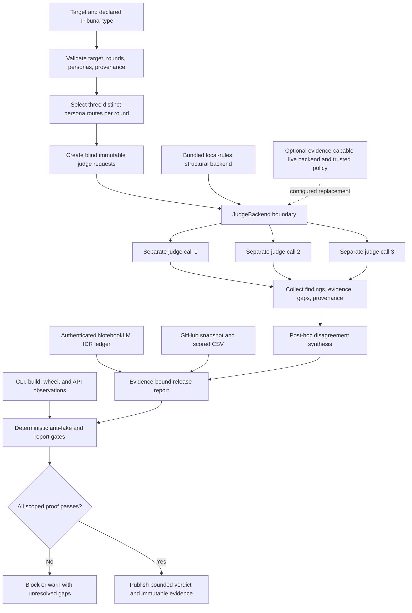

# Codex Tribunal Library: live IDR and adversarial tribunal

Audit date: `2026-07-20`

Declared use case: a reusable, hard-critical review layer for knowledge/correctness, critique/risk, and UI/UX feasibility, with blind initial views, explicit evidence gaps, a disclosed Karpathy-inspired critic, stable CLI/API output, and low-friction OSS reuse.

**Final verdict:** ship Codex Tribunal for the bounded offline orchestration and reusable-skill scope. Keep it thin and compose mature OSS for adversarial CI, live runtimes, and observability. Do not represent the bundled backend as semantic verification, visual testing, provider-family independence, or a production trace platform.

The single crown below is a narrow, project-authored fit assessment backed by the published rubric and deterministic gates. It is not an independent benchmark, community validation, a runtime semantic score, or a claim of universal product superiority.

## IDR

IDR: ja

- Canonical NotebookLM notebook: https://notebooklm.google.com/notebook/80cffd38-0185-4f4d-ae00-bbc67c4bc515
- Verified again at `2026-07-20T20:49:06Z` through the authenticated `nlm 0.8.9` CLI.
- Notebook title: `Tribunal IDR 2026-07-04`.
- Public-link sharing was enabled and the notebook identity was verified by ID, not inferred from a pasted URL.
- Final direct corpus inventory after this pass: `560` sources. Of these, `549` were processed and `11` failed. Thirteen uniquely titled brief-live sources were added and processed: four new OpenSpec artifacts, eight starting-HEAD project snapshots, and one direct executable contradiction control. The inherited failures were duplicate or secondary pages and were excluded from every selected query.
- This pass ran three role-aligned cross-source queries followed by a fourth contradiction/source-attribution control. Direct CLI inventory and primary/executable project evidence overruled generated prose whenever it invented code defects, reused historical provider facts, confused totals, or imported mutable stars and study metrics as local measurements.

The complete historical ledgers remain available in [`evidence/notebooklm-live-audit.md`](evidence/notebooklm-live-audit.md) and [`evidence/final-notebooklm-revalidation.md`](evidence/final-notebooklm-revalidation.md). The authoritative inventory, four questions, grounding counts, false-blocker controls, and manual corrections for this brief are retained in [`evidence/brief-live-notebooklm.md`](evidence/brief-live-notebooklm.md).

## Method

1. **OpenSpec-first contract.** This pass was specified before live work in [`../openspec/changes/complete-live-codex-tribunal-library-brief/`](../openspec/changes/complete-live-codex-tribunal-library-brief/): proposal, design, capability scenarios, and 37 checkable tasks. Earlier completed changes remain historical inputs.
2. **Canonical live research.** One authenticated NotebookLM notebook was inventoried, thirteen uniquely titled brief-live sources were added and processed, and three role queries plus one contradiction/source-attribution control ran against a selected current/primary source set.
3. **OSS before custom work.** Eleven viable repositories were compared. Canonical GitHub metadata, license signals, activity, README feature claims, and star counts were read live. Stars are dated adoption context and contribute zero rubric points.
4. **Blind adversarial judgments.** Three role-specific prompts were sent in separate fresh sessions with no sibling verdict or draft synthesis. The common evidence packet was conclusion-free. Synthesis began only after accepted outputs were frozen.
5. **Adversarial control.** NotebookLM invented blocking syntax, packaging, backend, validator, and dependency defects from normalized excerpts. Compile, import, exact symbol, and wheel-listing controls rejected them. External judge outputs that violated file scope or did not inspect claimed evidence were also excluded.
6. **Real public-surface proof.** The comparison fixture ran through `tribunal.py`, then through a PEP 517-installed `tribunal` console script outside the repository. No model result or backend result was mocked.
7. **Fail-closed publication.** Unit, compile, skill, CSV, report, OpenSpec, link, staged-diff, remote-commit, and immutable-blob checks are the release gate.

This report distinguishes three different evidence classes: NotebookLM research about the design space; external model opinions about the repository snapshot; and executable proof of the local package contract. None substitutes for the others.

## Source inventory

### Research and evaluation sources

The processed corpus included the targeted authoritative/project sources for:

- promptfoo: https://github.com/promptfoo/promptfoo
- DeepEval: https://github.com/confident-ai/deepeval
- DSPy: https://github.com/stanfordnlp/dspy
- Langfuse: https://github.com/langfuse/langfuse
- Phoenix: https://github.com/Arize-ai/phoenix
- AutoGen: https://github.com/microsoft/autogen
- Ragas: https://github.com/vibrantlabsai/ragas
- OpenAI Evals: https://github.com/openai/evals
- lm-evaluation-harness: https://github.com/EleutherAI/lm-evaluation-harness
- multi-agent-debate research, Nielsen Norman Group usability heuristics, and W3C WCAG 2.2;
- the current Tribunal README, skill, runtime, report, package metadata, tests, matrix, synthetic-persona definition, and this brief's OpenSpec artifacts.

Microsoft Agent Framework, https://github.com/microsoft/agent-framework, was added to the live OSS candidate matrix because AutoGen's current README places AutoGen in maintenance mode and recommends Agent Framework for new work.

### Live metadata evidence

GitHub metadata was refreshed concurrently from the authenticated REST endpoint and timestamped only after all eleven calls completed: `2026-07-20T21:07:01Z`. The machine-readable record is [`evidence/github-snapshot.json`](evidence/github-snapshot.json); the scoring record is [`codex-trib-lib-matrix.csv`](codex-trib-lib-matrix.csv); command disposition and primary license checks are in [`evidence/brief-live-oss.md`](evidence/brief-live-oss.md). Direct license-file checks reconfirmed AutoGen's CC-BY-4.0 repository license and maintenance-mode migration notice, OpenAI Evals' dataset exceptions, Langfuse's enterprise-directory exclusions, and Phoenix's Elastic License 2.0 hosted-service restriction.

### Evidence-quality rule

Primary documentation and executable project behavior outrank generated characterizations. A processed source is not automatically a correct interpretation, a syntactically valid URL is not proof that the runtime queried it, and an empty model-declared evidence-gap list is not independently verified truth.

## NotebookLM cross-query synthesis

| Query | Returned grounding metadata | Decision-relevant result | Manual correction/control |
|---|---:|---|---|
| Correctness and independence | 12 source IDs, 49 citation mappings | Deterministic checks validate orchestration structure, not factual truth. URL provenance, persona identity, packaging metadata, and post-hoc synthesis are real; semantic, visual, family-diversity, and durable-trace proof remain external. | Rejected a false raw-target claim, historical Grok/fallback facts, mutable stars, and literature metrics imported as local measurements. |
| Hostile risks and mitigations | 10 source IDs, 28 citation mappings | Future live deployments must address common-mode errors, style/injection sensitivity, provider/model provenance, trusted budgets, and recovery. Primary license caveats remain material. | Rejected invented syntax, persona-package, backend-method, dead-validator, and Pydantic blockers; direct controls contradicted each. |
| CLI UX and feasibility | 10 source IDs, 37 citation mappings | Bounded help/input behavior, clean errors, package metadata, safe Markdown/lossless JSON, persona disclosure, and OSS composition support CLI use. No browser/TUI or human-task proof exists. | Rejected the repeated fake runtime/package blockers, historical provider claims, and optional progress/config ideas promoted into current requirements. |
| Contradiction/source attribution | 8 source IDs, 31 citation mappings | Correctly rejected all named fake code/package blockers, Pydantic, raw-target, durable-capacity, historical-provider, and star/literature-as-local claims. | It still mislabeled `549` as the total after receiving `560/549/11`; final direct JSON is authoritative: `560` total, `549` processed, `11` failed. |

IDR conclusion: the research supports Tribunal as an honest structural contract and extension point. It does not support a broader green claim. A production live backend must independently prove provider/model routing, actual source/tool use, trusted budgets, durable traces, retrieval safety, and any visual interaction assertions.

## Tribunal verdict 1: Knowledge and correctness

**Engine:** brief-approved `agy` fallback / `Gemini 3.1 Pro (High)`

**Run:** fresh isolated read-only plan session against the brief-live conclusion-free packet

**Score:** `98/100`

**Recommendation:** Ship with conditions

The judge directly rejected NotebookLM's invented syntax, package-data, backend-method, validator, and Pydantic defects, and highlighted the separate arithmetic failure in the source-count control. It found the structural/semantic boundary, bounded local score, primary license qualifications, syntactic-only NotebookLM provenance, post-hoc synthesis label, and Karpathy-inspired identity controls internally consistent.

Its conditions are the controlling release boundaries: keep structural-only disclaimers, reject generated project metrics/capabilities without primary or executable support, compose mature OSS for live semantics/durability, and preserve the persona disclaimer in every serialized surface.

Accepted verdict: [`evidence/brief-live-judge-knowledge.md`](evidence/brief-live-judge-knowledge.md).

## Tribunal verdict 2: Harsh critique and risks

**Engine:** brief-approved `agy` fallback / `Claude Sonnet 4.6 (Thinking)`

**Run:** fresh restricted-project read-only plan session against the brief-live conclusion-free packet; an earlier cross-repository session was excluded

**Score:** `73/100`

**Recommendation:** Ship with conditions

The hostile judge preserved four material boundaries: the `85/100` comparative matrix is an external fit rubric rather than a live semantic runtime score; an injected backend self-declares its score and gap list; capacity is deliberately per-run rather than durable provider/billing enforcement; and the frozen packet still needed fresh clean-install CLI/API evidence before publication.

It also noted that Markdown deliberately flattens backend-authored newlines while JSON stays lossless, and that capability emoji/arithmetic gates cannot independently prove the substantive evidence behind a cell. The first points are published contract boundaries rather than fresh runtime failures; the missing installed-package proof is closed only by the E2E run later in this report.

Two findings remain useful pressure:

- High-stakes live use needs real provider/model provenance, explicit trust in backend-declared gaps, injection controls, calibration, and durable quotas/traces outside this core.
- A matrix capability cell means fit/native support for the declared comparison, not visual, semantic, or runtime success proof.

Accepted verdict: [`evidence/brief-live-judge-critique.md`](evidence/brief-live-judge-critique.md).

## Tribunal verdict 3: UX and implementability

**Engine:** brief-approved `agy` fallback / `Gemini 3.5 Flash (Low)`

**Run:** fresh isolated read-only plan session against the final conclusion-free packet

**Score:** `99/100`

**Recommendation:** Ship

The UX judge directly inspected the CLI, README, packaging, skill, tests, and examples. It found Markdown/HTML neutralization, concise exit-2 error handling, package entry-point/persona-data declarations, UI/UX routing, and the explicit visual-evidence boundary strong.

Its positive score is bounded by the packet and synthesis:

- It is a CLI/package feasibility view, not a browser, viewport, accessibility, or human-task validation.
- It does not replace the independently required clean-install E2E or deterministic release gates.
- Its claim of no additional implementation gaps is a judge opinion, not independent proof that external evidence gaps are empty.

Accepted verdict: [`evidence/brief-live-judge-ux.md`](evidence/brief-live-judge-ux.md).

## Debate and synthesis

### Required Grok path and truthful fallback

Three separate fresh commands were started for the final perspectives with the required form:

```text
grok --single <role-specific prompt> -m grok-4.5 --effort high
```

All three failed before a model answer with `HTTP 402 Payment Required: Grok Build usage balance exhausted`. No Grok prose is presented as a verdict. The authorized fallback started Gemini 3.1 Pro for knowledge, Claude Sonnet 4.6 for criticism, and GPT-OSS 120B for UX. Knowledge completed and was accepted. The first Claude output was excluded after it searched unrelated repositories; the first GPT-OSS output was incomplete. A scope-restricted Claude retry completed and was accepted. A scope-restricted GPT-OSS retry was excluded because it explicitly read only the packet and invented missing CLI/package behavior. A third, materially different Gemini 3.5 Flash UX session directly inspected the required files and was accepted.

The accepted set proves separate fresh sessions, conclusion-free input isolation, explicit file-scope attestation, and two provider families: Gemini for knowledge/UX and Claude for criticism. It does not prove statistical independence, provider-memory isolation, or three-family diversity. Complete attempt provenance and exclusions are retained in [`evidence/brief-live-external-attempts.md`](evidence/brief-live-external-attempts.md).

### Agreements

- The dependency-free core is coherent as structural orchestration plus a backend seam.
- `local-rules` is not semantic fact-checking, visual inspection, NotebookLM retrieval, live quota discovery, or model-family enforcement.
- Unique persona routes and separate requests are useful blind initial isolation but insufficient evidence of independent errors.
- JSON provenance, explicit gaps, input bounds, deterministic tests, and PEP 517 packaging are strong.
- Live deployments need external provider/model identity, executable evidence, trusted budgets, bias calibration, injection controls, and durable/visual surfaces appropriate to their claims.

### Material disagreements

- The knowledge judge treated the local evidence boundary as exceptionally strong; the critique judge deducted heavily because the comparative matrix is an external human/evidence rubric and custom backends self-declare scores/gaps. Both are true: the matrix is mechanically consistent but is not runtime semantic proof, and the backend is an explicit trust boundary.
- The critique judge read `UI/UX ✅` as a visual pass. In the feature matrix it means native fit for the declared UI/UX review mode and its evidence-gap contract; it does not mean the CLI rendered or validated a UI. The report now states this at the matrix.
- The UX judge found no implementation gap in its direct CLI/package read, while the critique judge required clean-install evidence. Synthesis sides with the stricter evidence rule: publication waits for exact-wheel console and API observations.
- All judges acknowledged that semantic verification, calibrated diversity, persistent traces, durable quotas, and visual proof are external to the thin core.

### Synthesized verdict

Scores `98/100`, `73/100`, and `99/100` are not averaged into a fictional consensus because the roles assessed different risk surfaces and only two provider families. No accepted judge reproduced a source-level defect in the declared local CLI/API/skill contract. The critical verdict controls evidence boundaries: matrix fit is distinct from runtime score, backend gap claims are self-declared, and clean-install proof is required before publication. Subject to that E2E and the release gates, Codex Tribunal is fit to ship as an auditable offline orchestration contract and reusable skill; production semantic judgment remains an integration. Full disposition: [`evidence/brief-live-synthesis.md`](evidence/brief-live-synthesis.md).

## 100-point rubric

| Dimension | Weight | High-score anchor | Anti-gaming rule |
|---|---:|---|---|
| Type Fit | 25 | Native coverage of knowledge, critique, and UI/UX plus isolated initial views | Generic evaluation or tracing receives partial credit only |
| Adversarial Depth | 20 | Specialized judges, blind initial verdicts, bias controls, heterogeneous boundaries | Role labels alone are not independence |
| Evidence | 20 | Primary/executable proof, citations, explicit gaps, rerunnable gates | Stars and unsupported prose receive zero evidence points |
| Extensibility | 15 | Validated/discoverable personas, reusable skills, backend/plugin seams | A generic callback without routing receives partial credit |
| Repeatability | 10 | Stable schemas, deterministic reruns, traces, pinned provenance | Screenshots or unrecorded sessions do not count |
| Integration | 10 | Small dependency/security surface and clear embedding contract | Missing integrations are not automatically a benefit |

Every component is an integer bounded by its weight; all six components sum to the total. Stars add zero points. A deterministic-gate failure, fabricated provenance, hidden category mismatch, or winning score below 70 vetoes the winner marker.

This comparative score is not the runtime `local-rules` score. The matrix rates repository fit for the declared six-dimension use case using external research and executable evidence; `local-rules` rates only one invocation's structural setup and is deliberately capped at `40/50`. Neither score is semantic truth, and a runtime `⚠️` does not become a runtime crown because the separate OSS matrix crowns the strongest bounded product fit.

### Score breakdown

| Rank | Tool | Fit /25 | Adversarial /20 | Evidence /20 | Extensibility /15 | Repeatability /10 | Integration /10 | Total |
|---:|---|---:|---:|---:|---:|---:|---:|---:|
| 1 | Codex Tribunal | 25 | 13 | 18 | 15 | 7 | 7 | 85/100 |
| 2 | promptfoo | 15 | 16 | 18 | 11 | 10 | 8 | 78/100 |
| 3 | Microsoft Agent Framework | 17 | 12 | 12 | 15 | 10 | 6 | 72/100 |
| 4 | DeepEval | 13 | 12 | 17 | 10 | 9 | 7 | 68/100 |
| 5 | AutoGen | 16 | 14 | 10 | 14 | 6 | 4 | 64/100 |
| 6 | Ragas | 11 | 8 | 17 | 9 | 9 | 7 | 61/100 |
| 7 | OpenAI Evals | 10 | 7 | 17 | 8 | 10 | 7 | 59/100 |
| 8 | Langfuse | 8 | 6 | 18 | 10 | 10 | 6 | 58/100 |
| 9 | DSPy | 9 | 8 | 12 | 14 | 8 | 6 | 57/100 |
| 10 | Phoenix | 8 | 6 | 18 | 10 | 10 | 4 | 56/100 |
| 11 | lm-evaluation-harness | 7 | 5 | 18 | 7 | 10 | 6 | 53/100 |

## OSS feature matrix

Snapshot completed UTC: `2026-07-20T21:07:01Z`. Capability cells mean verified/native fit for the declared comparison (`✅`), partial/composable fit (`⚠️`), or absent fit (`❌`); they are not semantic target scores or visual test passes. Scores and unformatted star values are duplicated here for human review; the CSV is authoritative and mechanically gated.

| Rank | Tool | GitHub repository | Stars | License qualification | Knowledge | Critique | UI/UX | Independent judges | Evidence | Persona/skill | Repeatability | Score | Result |
|---:|---|---|---:|---|:---:|:---:|:---:|:---:|:---:|:---:|:---:|---:|:---:|
| 1 | Codex Tribunal | https://github.com/Martin-Hausleitner/tribunal-public | 0 | MIT | ✅ | ✅ | ✅ | ⚠️ | ✅ | ✅ | ⚠️ | 85/100 | 👑 |
| 2 | promptfoo | https://github.com/promptfoo/promptfoo | 23,443 | MIT | ✅ | ✅ | ⚠️ | ❌ | ✅ | ⚠️ | ✅ | 78/100 |  |
| 3 | Microsoft Agent Framework | https://github.com/microsoft/agent-framework | 12,251 | MIT | ⚠️ | ⚠️ | ⚠️ | ⚠️ | ⚠️ | ✅ | ✅ | 72/100 |  |
| 4 | DeepEval | https://github.com/confident-ai/deepeval | 16,981 | Apache-2.0 | ✅ | ⚠️ | ❌ | ❌ | ✅ | ⚠️ | ✅ | 68/100 |  |
| 5 | AutoGen | https://github.com/microsoft/autogen | 59,850 | CC-BY-4.0; maintenance mode; component-specific review | ⚠️ | ⚠️ | ⚠️ | ⚠️ | ⚠️ | ✅ | ⚠️ | 64/100 |  |
| 6 | Ragas | https://github.com/vibrantlabsai/ragas | 14,918 | Apache-2.0 | ✅ | ⚠️ | ❌ | ❌ | ✅ | ⚠️ | ✅ | 61/100 |  |
| 7 | OpenAI Evals | https://github.com/openai/evals | 18,955 | MIT code; dataset licenses vary | ✅ | ⚠️ | ❌ | ❌ | ✅ | ⚠️ | ✅ | 59/100 |  |
| 8 | Langfuse | https://github.com/langfuse/langfuse | 31,510 | MIT except declared enterprise directories | ⚠️ | ⚠️ | ❌ | ❌ | ✅ | ⚠️ | ✅ | 58/100 |  |
| 9 | DSPy | https://github.com/stanfordnlp/dspy | 36,259 | MIT | ⚠️ | ⚠️ | ❌ | ❌ | ⚠️ | ✅ | ✅ | 57/100 |  |
| 10 | Phoenix | https://github.com/Arize-ai/phoenix | 10,642 | Elastic-2.0; source-available, not OSI open source | ⚠️ | ⚠️ | ❌ | ❌ | ✅ | ⚠️ | ✅ | 56/100 |  |
| 11 | lm-evaluation-harness | https://github.com/EleutherAI/lm-evaluation-harness | 13,341 | MIT | ✅ | ❌ | ❌ | ❌ | ✅ | ⚠️ | ✅ | 53/100 |  |

The ranking is deliberately use-case-specific. promptfoo is stronger for ready-made adversarial assertions and CI regression. Microsoft Agent Framework is stronger for production multi-agent workflow runtime. DeepEval and Ragas provide richer evaluation metrics. Langfuse and Phoenix are stronger telemetry/experiment surfaces. DSPy is stronger for language-model program optimization. OpenAI Evals and lm-evaluation-harness are stronger established eval/benchmark runners.

## Verdict and recommendation

**Winner for the declared narrow use case: Codex Tribunal, `85/100`.** This is the project-authored, evidence-backed rubric result, not an externally calibrated benchmark. It wins on direct three-mode fit, blind per-persona backend calls, explicit gaps, a validated persona library, the disclosed implementation-first critic, the reusable skill, transparent local behavior, stable JSON/Markdown, and a zero-runtime-dependency install. The deductions are intentional: no family-diversity enforcement, calibration/bias probes, durable trace store, or bundled live backend.

The OSS-first recommendation is composition, not reinvention:

1. Keep Tribunal as the small review-control, provenance, and output contract.
2. Use promptfoo for red-team cases, assertion catalogs, and CI regression instead of building another evaluator catalog.
3. Use Microsoft Agent Framework when the deployment needs production multi-agent workflows, checkpoints, human-in-the-loop control, or broader provider orchestration.
4. Use Langfuse or another vetted observability platform for durable live traces rather than embedding a trace database here.
5. Inject a narrow evidence-capable provider backend only where semantic judging is required, and record actual provider/model/version, prompt/rubric identity, costs, citations, and gaps.
6. Keep executable, browser, accessibility, and security checks outside judge opinion and feed their observations into the verdict as evidence.

The Karpathy-inspired persona is intentionally direct and non-sycophantic: it rejects unnecessary abstraction and demands small understandable code plus runnable proof. “Uncensored” means hard criticism, not impersonation, harassment, unsafe instruction, or invented attribution. The persona is synthetic, neither authored nor endorsed by Andrej Karpathy, and its disclaimer now travels with standalone JSON and Markdown views.

## Implementation plan

### Delivered in this release

1. **Core contract:** `knowledge`, `critique`, `ui_ux`, and comparison modes; three persona slots per round; bounded Nx/hardness; isolated immutable judge requests; strict backend result validation; post-hoc synthesis.
2. **Persona library and skill:** nine validated JSON personas; public GitHub references; explicit role, stance, skill labels, reference input, and optional disclaimer; disclosed Karpathy-inspired implementation critic; reusable hard-criticism workflow.
3. **Operator and safety behavior:** concise expected CLI errors; stable JSON/Markdown; target and backend-output Markdown neutralization; positive markers only when every view reaches 80 and declares no gaps; bounded rounds/target length.
4. **Packaging:** PEP 517 project metadata, console script, bundled persona JSON, dependency-free runtime.
5. **Live evidence:** authenticated NotebookLM IDR with direct contradiction controls, three isolated accepted fallback verdicts after truthful Grok failures, two accepted provider families, live GitHub metadata, differentiated 100-point scoring, one winner, and preserved exclusion provenance.
6. **Anti-drift controls:** persona disclaimer serialized in judge views and Markdown; routed skill labels described as host responsibilities; report validation joined to the sibling CSV's snapshot, tools, URLs, scores, and winner; generated false blockers rejected by executable proof.

### Real E2E proof

The realistic comparison target asks whether Tribunal should remain narrow while promptfoo supplies adversarial CI and Microsoft Agent Framework supplies production runtime. It was executed through the repository CLI and a clean installed console entry point, with no mocked backend result:

```bash
tribunal \
  --mode comparison \
  --rounds 2 \
  --hardness hard \
  --personas systems-architect,knowledge-analyst,andrej-karpathy,ux-specialist,ux-researcher,ux-operator-flow \
  --target "Decide whether Codex Tribunal should remain the narrow review contract while promptfoo supplies adversarial CI and Microsoft Agent Framework supplies production multi-agent runtime; require dated OSS evidence, explicit category mismatches, and no crown when semantic proof is missing." \
  --notebooklm-url https://notebooklm.google.com/notebook/80cffd38-0185-4f4d-ae00-bbc67c4bc515 \
  --json
```

Observed: exit `0`; requested/effective rounds `2/2`; hardness `hard`; six coordinates from `R1J1` through `R2J3`; six unique personas; backend `local-rules`; engine source `builtin-local`; two explicit evidence gaps per view; `debate.kind=post-hoc-synthesis`; final `50/100`; marker `⚠️`; no runtime winner marker. The Karpathy-inspired disclaimer was present in JSON and Markdown. The same command worked from outside the repository after PEP 517 installation. An invalid NotebookLM reference exited `2` with concise stderr and no traceback. Full proof: [`evidence/live-audit-e2e.md`](evidence/live-audit-e2e.md).

This brief-live closure repeated the repository CLI, all three primary modes, comparison case, expected failure, two isolated PEP 517 sdist/wheel builds, exact-wheel install, installed console script, installed Python API, JSON serialization, and Markdown disclaimer outside the repository. The independently verified wheel SHA-256 is `3133ca32a0ffdd3245146bda78ba864a2235475e7482e36e1723a31709e60b7f`. Every surface reproduced the bounded contract; both build hashes, commands, observations, the non-blocking setuptools license-metadata warning, and two excluded initial test-driver mistakes are retained in [`evidence/brief-live-e2e.md`](evidence/brief-live-e2e.md). Historical final-revalidation evidence remains in [`evidence/final-revalidation-e2e.md`](evidence/final-revalidation-e2e.md).

### Recommended next increments

1. Place live-provider adapters in a separate package and record immutable provider/model/version, prompt/rubric, latency, token/cost, source, and error provenance.
2. Add an opt-in policy that requires distinct provider/model families and fails closed when observed provenance is insufficient. Call this diversity enforcement, not statistical independence.
3. Calibrate judge behavior with pair-order swaps, formatting perturbations, adversarial fixtures, and disagreement thresholds before using scores for high-stakes automation.
4. Put durable budgets, retry state, trace persistence, and prompt-injection controls at a trusted execution boundary.
5. If a visual product is added, test real viewports, keyboard navigation, semantics, contrast, error recovery, and repeated operator tasks before any UI/UX pass.



## Limitations

- The bundled `local-rules` backend checks structure only. Its `40/100` result without a notebook reference and `50/100` with one are transparent readiness markers, not target-quality scores.
- NotebookLM URL validation checks syntax only. Live corpus/query proof is external and retained in the IDR ledger; the runtime does not fetch notebook content.
- A custom backend can send every request to one model and can self-declare empty gaps. The library records claims and provenance but cannot independently make them true.
- The accepted brief-live verdict set used the authorized fallback and two provider families: Gemini for knowledge/UX and Claude for criticism. This is some family diversity, not statistical independence, provider-memory isolation, three-family coverage, or bias calibration.
- Grok 4.5 was installed and authenticated but all three required high-effort calls failed before model output with HTTP 402. No Grok verdict was fabricated.
- This pass reproduced all three Grok 402 failures. One Claude output was excluded for cross-repository scope contamination; two GPT-OSS outputs were excluded as incomplete or unsupported by inspected source; fresh restricted Claude and Gemini sessions completed the accepted critique and UX roles.
- Synthesis is post-hoc. Judges do not inspect or answer sibling arguments through the current `JudgeRequest` contract.
- Arbitrary backend Markdown is normalized for safe rendering; JSON is the lossless surface. A safe structured-rendering contract remains future work.
- No TUI/web UI exists. CLI proof cannot establish visual polish, responsive layout, contrast, interaction quality, or end-user task success.
- Routed skill names are declared labels. The core does not discover, validate installation of, or invoke external Codex skills; the host must do so and fail visibly when a required capability is unavailable.
- Capacity values are per-run planning slots, not tokens, live provider quotas, billing controls, or persistent budgets.
- Persona rotation is deterministic. Nine bundled personas repeat after three complete rounds; a requested explicit three-person panel repeats every round.
- GitHub stars are mutable adoption signals and provide zero points. License summaries are repository-level observations, not legal advice.
- The NotebookLM corpus contains duplicated/mixed-quality material, and generated answers made demonstrable characterization errors. Manual contradiction controls therefore outrank model prose.
- The Karpathy-inspired critic is synthetic and cannot attribute generated judgments to the real person.

## Reproduction

Run from the repository root with Python 3.10 or newer:

```bash
python -m unittest discover -s tests -v
python -m py_compile tribunal.py personas/__init__.py scripts/csv_gate.py scripts/report_gate.py scripts/skill_gate.py tests/test_tribunal.py examples/e2e_demo.py examples/phase1_core_modes.py
python scripts/skill_gate.py skill/SKILL.md
python scripts/csv_gate.py report/codex-trib-lib-matrix.csv
python scripts/report_gate.py report/codex-trib-lib-tribunal.md
openspec validate live-audit-codex-tribunal-library --strict
openspec validate revalidate-live-codex-tribunal-library --strict
openspec validate complete-live-codex-tribunal-library-brief --strict
python -m build
python examples/phase1_core_modes.py
python examples/e2e_demo.py
```

Clean-install proof:

```bash
python -m venv /tmp/tribunal-live-audit-venv
/tmp/tribunal-live-audit-venv/bin/python -m pip install .
cd /tmp
/tmp/tribunal-live-audit-venv/bin/tribunal --mode knowledge --target "Installed package E2E" --json
```

Evidence index:

- Current brief baseline and guard state: [`evidence/brief-live-baseline.md`](evidence/brief-live-baseline.md)
- Current authenticated NotebookLM IDR: [`evidence/brief-live-notebooklm.md`](evidence/brief-live-notebooklm.md)
- Current primary OSS snapshot and rubric check: [`evidence/brief-live-oss.md`](evidence/brief-live-oss.md)
- Current frozen judge packet: [`evidence/brief-live-judge-packet.md`](evidence/brief-live-judge-packet.md)
- Current Grok/fallback attempts and exclusions: [`evidence/brief-live-external-attempts.md`](evidence/brief-live-external-attempts.md)
- Current accepted knowledge, criticism, and UX verdicts: [`evidence/brief-live-judge-knowledge.md`](evidence/brief-live-judge-knowledge.md), [`evidence/brief-live-judge-critique.md`](evidence/brief-live-judge-critique.md), [`evidence/brief-live-judge-ux.md`](evidence/brief-live-judge-ux.md)
- Current synthesis and finding disposition: [`evidence/brief-live-synthesis.md`](evidence/brief-live-synthesis.md)
- Current source/build/wheel/console/API proof: [`evidence/brief-live-e2e.md`](evidence/brief-live-e2e.md)

- Baseline and tool/authentication record: [`evidence/live-audit-baseline.md`](evidence/live-audit-baseline.md)
- Final revalidation baseline: [`evidence/final-revalidation-baseline.md`](evidence/final-revalidation-baseline.md)
- NotebookLM live IDR: [`evidence/notebooklm-live-audit.md`](evidence/notebooklm-live-audit.md)
- NotebookLM revalidation and contradiction control: [`evidence/notebooklm-revalidation.md`](evidence/notebooklm-revalidation.md)
- Final NotebookLM inventory and cross-query audit: [`evidence/final-notebooklm-revalidation.md`](evidence/final-notebooklm-revalidation.md)
- Frozen blind judge packet: [`evidence/live-audit-judge-packet.md`](evidence/live-audit-judge-packet.md)
- Frozen revalidation packet: [`evidence/revalidation-judge-packet.md`](evidence/revalidation-judge-packet.md)
- Final frozen judge packet: [`evidence/final-revalidation-judge-packet.md`](evidence/final-revalidation-judge-packet.md)
- Grok failures, fallback provenance, and discarded attempts: [`evidence/live-audit-grok-attempts.md`](evidence/live-audit-grok-attempts.md)
- Revalidation Grok/agy attempts: [`evidence/revalidation-external-attempts.md`](evidence/revalidation-external-attempts.md)
- Final Grok/agy attempts and exclusions: [`evidence/final-revalidation-external-attempts.md`](evidence/final-revalidation-external-attempts.md)
- Knowledge verdict: [`evidence/live-audit-judge-knowledge.md`](evidence/live-audit-judge-knowledge.md)
- Additional revalidation knowledge verdict: [`evidence/revalidation-judge-knowledge.md`](evidence/revalidation-judge-knowledge.md)
- Final knowledge verdict: [`evidence/final-revalidation-judge-knowledge.md`](evidence/final-revalidation-judge-knowledge.md)
- Final harsh-critique verdict: [`evidence/final-revalidation-judge-critique.md`](evidence/final-revalidation-judge-critique.md)
- Final UX verdict: [`evidence/final-revalidation-judge-ux.md`](evidence/final-revalidation-judge-ux.md)
- Harsh-critique verdict: [`evidence/live-audit-judge-critique.md`](evidence/live-audit-judge-critique.md)
- UX verdict: [`evidence/live-audit-judge-ux.md`](evidence/live-audit-judge-ux.md)
- Frozen synthesis and finding disposition: [`evidence/live-audit-synthesis.md`](evidence/live-audit-synthesis.md)
- Final synthesis and finding disposition: [`evidence/final-revalidation-synthesis.md`](evidence/final-revalidation-synthesis.md)
- GitHub metadata: [`evidence/github-snapshot.json`](evidence/github-snapshot.json)
- Machine-readable matrix: [`codex-trib-lib-matrix.csv`](codex-trib-lib-matrix.csv)
- Public CLI/package proof: [`evidence/live-audit-e2e.md`](evidence/live-audit-e2e.md)
- Fresh CLI/API/installed-package proof: [`evidence/revalidation-e2e.md`](evidence/revalidation-e2e.md)
- Final source/build/wheel/CLI/API proof: [`evidence/final-revalidation-e2e.md`](evidence/final-revalidation-e2e.md)

The release is complete only when these exact artifacts pass the gates, are committed together, the branch push contains that commit, and the final report is retrievable at a SHA-pinned public GitHub blob URL.
