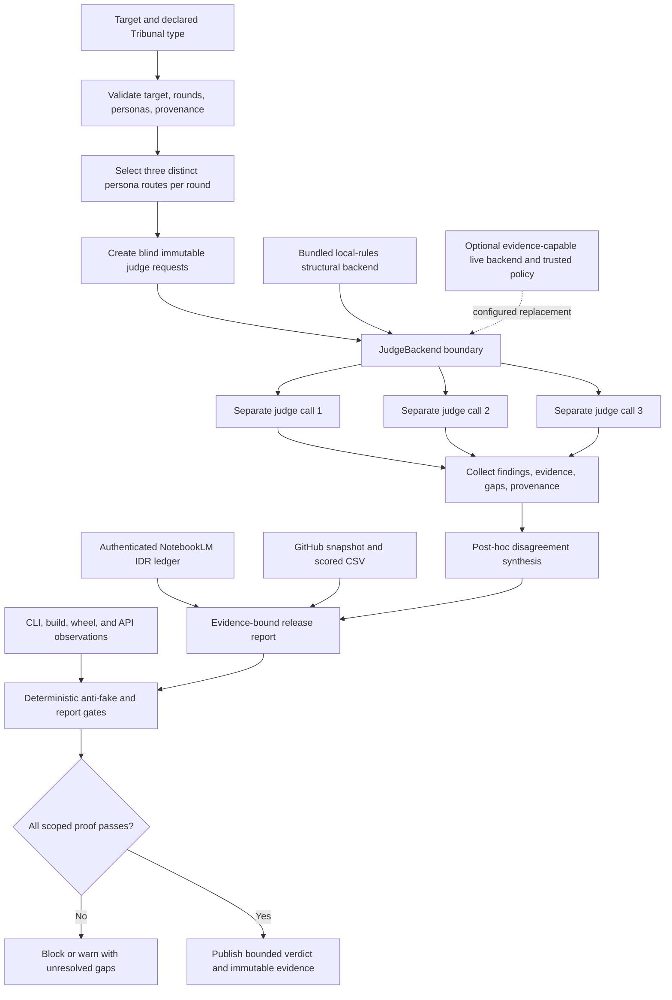

# Codex Tribunal Library: live IDR and adversarial tribunal

Audit date: `2026-07-21`

Declared use case: a reusable, hard-critical review layer for knowledge/correctness, critique/risk, and UI/UX feasibility, with blind initial views, explicit evidence gaps, a disclosed Karpathy-inspired critic, stable CLI/API output, and low-friction OSS reuse.

**Final verdict:** ship Codex Tribunal for the bounded offline orchestration and reusable-skill scope. Keep it thin and compose mature OSS for adversarial CI, live runtimes, and observability. Do not represent the bundled backend as semantic verification, visual testing, provider-family independence, or a production trace platform.

The single crown below is a narrow, project-authored fit assessment backed by the published rubric and deterministic gates. It is not an independent benchmark, community validation, a runtime semantic score, or a claim of universal product superiority.

## IDR

IDR: ja

- Canonical public NotebookLM notebook: https://notebooklm.google.com/notebook/80cffd38-0185-4f4d-ae00-bbc67c4bc515
- Authenticated identity, title `Tribunal IDR 2026-07-04`, and public sharing were reverified with `nlm 0.8.9`.
- The final direct inventory was `875` total sources: `600` processed and `275` failed. The canonical notebook is at its exact processed-source ceiling.
- Two uniquely titled current-pass manifests returned IDs but settled empty at failed status `3`. Creating another notebook failed safely while the account contained exactly `500` notebooks. No unrelated user notebook or processed source was deleted, renamed, or repurposed; failed source IDs were excluded from every query.
- Five broad fresh conversations covered knowledge, hostile risk, CLI UX, OSS composition, and contradiction/source attribution. Because several follow-ups over-relied on a prior report, four new non-circular controls excluded that report entirely.
- The non-circular knowledge control returned `13` selected source IDs and `34` citation mappings; the UX control used the code snapshot, promptfoo, Agent Framework, Nielsen, and WCAG; the OSS control cited all ten canonical alternatives.
- NotebookLM still treated old snapshot behavior as current and described interactive debate in one hostile answer even though the implementation is post-hoc. Exact current code, primary metadata, and execution overruled those statements.

The current source IDs, conversation UUIDs, grounding metadata, capacity failures, exclusions, and manual corrections are retained in [`evidence/revalidation-2026-07-21-notebooklm.md`](evidence/revalidation-2026-07-21-notebooklm.md). Earlier ledgers remain historical inputs, not current proof.

## Method

1. **OpenSpec-first contract.** The current run is specified in [`../openspec/changes/revalidate-codex-tribunal-library-2026-07-21/`](../openspec/changes/revalidate-codex-tribunal-library-2026-07-21/): proposal, design, nine testable requirements, and 42 checkable tasks.
2. **Canonical live research.** Authentication, public sharing, source/account capacity, processed source IDs, nine fresh conversations, and non-circular controls were observed directly. Failed sources were never treated as research.
3. **OSS before custom work.** Eleven primary GitHub REST endpoints and relevant root README/license files were refreshed. Stars are numeric, dated, and worth zero rubric points.
4. **Blind adversarial judgments.** Three required Grok 4.5 High calls reached the service but stopped before model output with HTTP 402. The brief-authorized fallback produced three accepted isolated `agy` verdicts from one frozen, conclusion-free packet.
5. **Adversarial controls.** Every generated claim was separated into current fact, historical finding, documented non-capability, hypothesis, or pending proof. The only new reproduced blocker was stale CSV metadata relative to the new snapshot.
6. **Scoped implementation.** The CSV timestamp and seven changed star values were synchronized. No runtime change was made because the source, unit, build, installed console/API, and expected-error surfaces reproduced no runtime defect.
7. **Fail-closed publication.** Unit, compile, examples, build, wheel contents, clean install, installed CLI/API, skill, CSV, report, strict OpenSpec, diff, remote SHA, clean tree, and immutable public retrieval gate the handoff.

NotebookLM synthesis, external judge opinion, GitHub primary metadata, project-authored scoring, and executable package behavior are separate evidence classes. None substitutes for another.

## Source inventory

### Research and evaluation sources

The selected processed set included canonical repository sources for:

- promptfoo: https://github.com/promptfoo/promptfoo
- DeepEval: https://github.com/confident-ai/deepeval
- DSPy: https://github.com/stanfordnlp/dspy
- Langfuse: https://github.com/langfuse/langfuse
- Phoenix: https://github.com/Arize-ai/phoenix
- AutoGen: https://github.com/microsoft/autogen
- Microsoft Agent Framework: https://github.com/microsoft/agent-framework
- Ragas: https://github.com/vibrantlabsai/ragas
- OpenAI Evals: https://github.com/openai/evals
- lm-evaluation-harness: https://github.com/EleutherAI/lm-evaluation-harness

Role-specific selected sets also contained Nielsen Norman Group usability heuristics, W3C WCAG 2.2 Quick Reference, multi-agent-debate research, an ACL position-bias study, and a Tribunal source snapshot. The pass started from HEAD `56df1b0c99e3c75546585ad5e4aea6f784081db5`; the code snapshot predates later validator fixes, so exact current source and executable behavior control every conflict.

### Live metadata evidence

GitHub metadata was refreshed concurrently and timestamped after all eleven primary REST calls completed: `2026-07-20T23:15:54Z`. The machine-readable record is [`evidence/github-snapshot.json`](evidence/github-snapshot.json), the score record is [`codex-trib-lib-matrix.csv`](codex-trib-lib-matrix.csv), and batch/license/rubric evidence is in [`evidence/revalidation-2026-07-21-oss.md`](evidence/revalidation-2026-07-21-oss.md). Root-file reads reconfirmed AutoGen's maintenance notice and successor guidance, OpenAI Evals' dataset exceptions, Langfuse's named enterprise-directory exclusions, and Phoenix's Elastic License 2.0 hosted-service restriction.

### Evidence-quality rule

Primary documentation and current executable behavior outrank generated characterizations. A processed source is not automatically interpreted correctly, an accepted source-add command is not proof of later processing, a valid NotebookLM URL is not proof of a query, and an empty model-declared gap list is not verified truth.

## NotebookLM cross-query synthesis

| Query/control | Returned grounding metadata | Decision-relevant result | Manual correction/control |
|---|---:|---|---|
| Knowledge/correctness, no prior report | 13 source IDs, 34 citation mappings | Supports strict structural boundaries, complementary OSS capabilities, and judge-bias limits. | The multi-agent-debate paper is external research, not proof that post-hoc Tribunal synthesis has the same effect. |
| Harsh criticism, no prior report | `sources_used` named only the ACL position-bias study | Retains judge/task dependence and answer-quality-gap sensitivity as deployment risks. | Rejected claims of interactive collusion and exponential parser failure; neither was grounded or reproduced. |
| CLI UX/feasibility, no prior report | 5 source IDs | Supports discoverable CLI mechanics and a clear list of visual/AT/human-task checks a terminal cannot prove. | Rejected an irrelevant Azure authentication aside; Nielsen/WCAG remain criteria, not passed tests. |
| OSS composition, no prior report | all 10 repository source IDs | Maps red-team, orchestration, metric, benchmark, optimization, and observability capabilities to mature projects. | Composing all ten at once would be needless complexity; select only the needed adjacent surface. |
| Contradiction/source attribution | ACL study plus historical report | Reinforces bias risk and the evidence hierarchy. | Current code, GitHub reads, and execution control all mutable claims. |

Every accepted control used a fresh conversation UUID and explicit source IDs. Broad answers that collapsed back to the historical report were retained only as provenance and did not establish new facts.

IDR conclusion: the corpus supports Tribunal as an honest structural contract and extension point. It does not support native semantic verification, visual accessibility testing, provider-family independence, durable quota/trace enforcement, or production calibration.

## Tribunal verdict 1: Knowledge and correctness

**Engine:** brief-approved `agy` fallback / `Gemini 3.1 Pro (High)`

**Run:** fresh isolated read-only plan session against packet SHA-256 `59de53373a1386b2d14ed7d8d82ad6f9493d1d2247eefebd93df1069bb8b1521`

**Score:** `80/100`

**Recommendation:** Conditional

The judge found the persona disclosure, OSS rubric constraints, code/document boundaries, and local `50/100` maximum structurally consistent. It conditioned release on the still-pending current-pass unit, compile, build, clean-install, installed CLI/API, publication, and immutable-blob gates. It also required NotebookLM overgeneralizations to remain subordinate to direct proof.

Accepted verdict: [`evidence/revalidation-2026-07-21-judge-knowledge.md`](evidence/revalidation-2026-07-21-judge-knowledge.md).

## Tribunal verdict 2: Harsh critique and risks

**Engine:** brief-approved `agy` fallback / `Gemini 3.5 Flash (High)`

**Run:** fresh isolated read-only plan session against the same frozen packet, after the preferred Claude session was quota-blocked before output

**Score:** `40/100`

**Recommendation:** Block

The hostile judge found one new concrete blocker: the CSV still used the earlier timestamp and seven stale star values while the current GitHub ledger had already advanced. It also reiterated provider-family non-enforcement, post-hoc rather than interactive debate, presentation-only Markdown hardening, and pending release proof.

Direct disposition preserves the hostile verdict while separating current defects from boundaries:

- The CSV timestamp and all seven changed star values were synchronized to `2026-07-20T23:15:54Z`; the CSV gate then passed with 11 rows and one crown.
- Provider/model diversity is explicitly not enforced; separate request calls are blind process coordinates, not statistical independence.
- Synthesis is explicitly labeled `post-hoc-synthesis`; no interactive debate is claimed.
- Markdown hardening is explicitly not prompt-injection defense.
- The judge's `40/100` rationale reused the runtime structural ceiling for an external product review. That cross-instrument comparison is rejected, while the independent blocking recommendation is preserved.

Accepted verdict: [`evidence/revalidation-2026-07-21-judge-critique.md`](evidence/revalidation-2026-07-21-judge-critique.md).

## Tribunal verdict 3: UX and implementability

**Engine:** brief-approved `agy` fallback / `Gemini 3.5 Flash (Medium)`

**Run:** fresh isolated read-only plan session against the same frozen packet

**Score:** `92/100`

**Recommendation:** Conditional

The UX judge found comprehensive `argparse` help, concise expected-error handling, strict bounds, safe display rendering, README examples, and serialized persona disclosure. It retained the generic top-level `personas` package as a future collision/breaking-migration concern and conditioned release on clean-install, package, CLI/API, and publication proof.

The verdict remains a CLI/package feasibility view, not browser, viewport, accessibility, assistive-technology, or human-task validation; it also does not turn `local-rules` into semantic or NotebookLM retrieval.

Accepted verdict: [`evidence/revalidation-2026-07-21-judge-ux.md`](evidence/revalidation-2026-07-21-judge-ux.md).

## Debate and synthesis

### Brief-authorized judge path and truthful exclusions

The guard reported `session_used=9`, `weekly_used=73`, and `fast=not_seen`, so no expensive Codex/OMX team burst or fast mode was started. Three separate `grok --single -m grok-4.5 --effort high` calls were made exactly as requested; all three stopped before model output with HTTP 402 because the Grok Build balance was exhausted.

The brief-authorized `agy` fallback then ran fresh isolated sessions. Gemini 3.1 Pro High completed knowledge; Claude Sonnet 4.6 Thinking was quota-blocked before output; Gemini 3.5 Flash High completed criticism; and Gemini 3.5 Flash Medium completed UX.

The accepted set proves separate fresh sessions, role prompts, conclusion-free packet isolation, and file-scope attestation. All accepted verdicts are Gemini-family models, so no provider-family diversity, statistical independence, provider-memory isolation, or correlated-bias control is claimed. Full provenance: [`evidence/revalidation-2026-07-21-external-attempts.md`](evidence/revalidation-2026-07-21-external-attempts.md).

### Agreements

- The dependency-free core is coherent as structural orchestration plus a backend seam.
- `local-rules` is not semantic fact checking, visual inspection, NotebookLM retrieval, live quota discovery, or family enforcement.
- Unique personas and separate calls are useful blind routing but insufficient proof of independent errors.
- Bounded inputs/errors, JSON provenance, explicit gaps, packaging, and disclaimer preservation are structurally coherent.
- Production use requires real provider/model provenance, trusted backend gaps, injection controls, calibration, durable budgets/traces, and external visual/executable evidence.

### Material disagreements

- Knowledge and UX rated the bounded contract `80` and `92` conditionally; criticism rated it `40` and blocked. Scores remain separate role judgments, not an average.
- Criticism's stale-matrix finding was reproduced exactly and fixed before final gates.
- UX retains the top-level `personas` package as a future major-version namespace concern. The current wheel and clean import work, but collision-free coexistence with every third-party distribution is not proved.
- Criticism's provider, debate, and prompt-injection points describe published non-capabilities, not hidden implementation claims.
- Criticism incorrectly mapped the `local-rules` 40/50 structural setup ceiling onto its independent product score. The score is preserved as judge output but not adopted as a comparable runtime measurement.
- All judges agree that backend truth, semantic verification, family diversity, persistent trace/budget state, and visual proof are external to the thin core.

### Synthesized verdict

Scores `80/100`, `40/100`, and `92/100` are not averaged because the roles assessed different surfaces and share one model family. The hostile verdict controls reproduced defects, not the final decision automatically. Its stale-matrix blocker was repaired; the accepted judge set required executable and publication proof before release, which the final gate sequence supplies. The remaining issues are explicit integration boundaries or a future breaking namespace migration. Codex Tribunal is fit to ship as an auditable offline orchestration contract and reusable skill, while semantic judgment, cross-family routing, durable budgets/traces, and visual proof remain integrations. Full disposition: [`evidence/revalidation-2026-07-21-synthesis.md`](evidence/revalidation-2026-07-21-synthesis.md).

## 100-point rubric

| Dimension | Weight | High-score anchor | Anti-gaming rule |
|---|---:|---|---|
| Type Fit | 25 | Native coverage of knowledge, critique, and UI/UX plus isolated initial views | Generic evaluation or tracing receives partial credit only |
| Adversarial Depth | 20 | Specialized judges, blind initial verdicts, bias controls, heterogeneous boundaries | Role labels alone are not independence |
| Evidence | 20 | Primary/executable proof, citations, explicit gaps, rerunnable gates | Stars and unsupported prose receive zero evidence points |
| Extensibility | 15 | Validated/discoverable personas, reusable skills, backend/plugin seams | A generic callback without routing receives partial credit |
| Repeatability | 10 | Stable schemas, deterministic reruns, traces, pinned provenance | Screenshots or unrecorded sessions do not count |
| Integration | 10 | Small dependency/security surface and clear embedding contract | Missing integrations are not automatically a benefit |

Every component is an integer bounded by its weight; all six components sum to the total. Stars add zero points. A deterministic-gate failure, fabricated provenance, hidden category mismatch, or winning score below 70 vetoes the winner marker.

This comparative score is not the runtime `local-rules` score. The matrix rates repository fit for the declared six-dimension use case using external research and executable evidence; `local-rules` rates only one invocation's structural setup and is deliberately capped at `40/50`. Neither score is semantic truth, and a runtime `⚠️` does not become a runtime crown because the separate OSS matrix crowns the strongest bounded product fit.

### Score breakdown

| Rank | Tool | Fit /25 | Adversarial /20 | Evidence /20 | Extensibility /15 | Repeatability /10 | Integration /10 | Total |
|---:|---|---:|---:|---:|---:|---:|---:|---:|
| 1 | Codex Tribunal | 25 | 13 | 18 | 15 | 7 | 7 | 85/100 |
| 2 | promptfoo | 15 | 16 | 18 | 11 | 10 | 8 | 78/100 |
| 3 | Microsoft Agent Framework | 17 | 12 | 12 | 15 | 10 | 6 | 72/100 |
| 4 | DeepEval | 13 | 12 | 17 | 10 | 9 | 7 | 68/100 |
| 5 | AutoGen | 16 | 14 | 10 | 14 | 6 | 4 | 64/100 |
| 6 | Ragas | 11 | 8 | 17 | 9 | 9 | 7 | 61/100 |
| 7 | OpenAI Evals | 10 | 7 | 17 | 8 | 10 | 7 | 59/100 |
| 8 | Langfuse | 8 | 6 | 18 | 10 | 10 | 6 | 58/100 |
| 9 | DSPy | 9 | 8 | 12 | 14 | 8 | 6 | 57/100 |
| 10 | Phoenix | 8 | 6 | 18 | 10 | 10 | 4 | 56/100 |
| 11 | lm-evaluation-harness | 7 | 5 | 18 | 7 | 10 | 6 | 53/100 |

## OSS feature matrix

Snapshot completed UTC: `2026-07-20T23:15:54Z`. Capability cells mean verified/native fit for the declared comparison (`✅`), partial/composable fit (`⚠️`), or absent fit (`❌`); they are not semantic target scores or visual test passes. Scores and unformatted star values are duplicated here for human review; the CSV is authoritative and mechanically gated.

| Rank | Tool | GitHub repository | Stars | License qualification | Knowledge | Critique | UI/UX | Independent judges | Evidence | Persona/skill | Repeatability | Score | Result |
|---:|---|---|---:|---|:---:|:---:|:---:|:---:|:---:|:---:|:---:|---:|:---:|
| 1 | Codex Tribunal | https://github.com/Martin-Hausleitner/tribunal-public | 0 | MIT | ✅ | ✅ | ✅ | ⚠️ | ✅ | ✅ | ⚠️ | 85/100 | 👑 |
| 2 | promptfoo | https://github.com/promptfoo/promptfoo | 23,446 | MIT | ✅ | ✅ | ⚠️ | ❌ | ✅ | ⚠️ | ✅ | 78/100 |  |
| 3 | Microsoft Agent Framework | https://github.com/microsoft/agent-framework | 12,253 | MIT | ⚠️ | ⚠️ | ⚠️ | ⚠️ | ⚠️ | ✅ | ✅ | 72/100 |  |
| 4 | DeepEval | https://github.com/confident-ai/deepeval | 16,983 | Apache-2.0 | ✅ | ⚠️ | ❌ | ❌ | ✅ | ⚠️ | ✅ | 68/100 |  |
| 5 | AutoGen | https://github.com/microsoft/autogen | 59,851 | CC-BY-4.0; maintenance mode; component-specific review | ⚠️ | ⚠️ | ⚠️ | ⚠️ | ⚠️ | ✅ | ⚠️ | 64/100 |  |
| 6 | Ragas | https://github.com/vibrantlabsai/ragas | 14,918 | Apache-2.0 | ✅ | ⚠️ | ❌ | ❌ | ✅ | ⚠️ | ✅ | 61/100 |  |
| 7 | OpenAI Evals | https://github.com/openai/evals | 18,956 | MIT code; dataset licenses vary | ✅ | ⚠️ | ❌ | ❌ | ✅ | ⚠️ | ✅ | 59/100 |  |
| 8 | Langfuse | https://github.com/langfuse/langfuse | 31,515 | MIT except declared enterprise directories | ⚠️ | ⚠️ | ❌ | ❌ | ✅ | ⚠️ | ✅ | 58/100 |  |
| 9 | DSPy | https://github.com/stanfordnlp/dspy | 36,262 | MIT | ⚠️ | ⚠️ | ❌ | ❌ | ⚠️ | ✅ | ✅ | 57/100 |  |
| 10 | Phoenix | https://github.com/Arize-ai/phoenix | 10,642 | Elastic-2.0; source-available, not OSI open source | ⚠️ | ⚠️ | ❌ | ❌ | ✅ | ⚠️ | ✅ | 56/100 |  |
| 11 | lm-evaluation-harness | https://github.com/EleutherAI/lm-evaluation-harness | 13,342 | MIT | ✅ | ❌ | ❌ | ❌ | ✅ | ⚠️ | ✅ | 53/100 |  |

The ranking is deliberately use-case-specific. promptfoo is stronger for ready-made adversarial assertions and CI regression. Microsoft Agent Framework is stronger for production multi-agent workflow runtime. DeepEval and Ragas provide richer evaluation metrics. Langfuse and Phoenix are stronger telemetry/experiment surfaces. DSPy is stronger for language-model program optimization. OpenAI Evals and lm-evaluation-harness are stronger established eval/benchmark runners.

## Verdict and recommendation

**Winner for the declared narrow use case: Codex Tribunal, `85/100`.** This is the project-authored, evidence-backed rubric result, not an externally calibrated benchmark. It wins on direct three-mode fit, blind per-persona backend calls, explicit gaps, a validated persona library, the disclosed implementation-first critic, the reusable skill, transparent local behavior, stable JSON/Markdown, and a zero-runtime-dependency install. The deductions are intentional: no family-diversity enforcement, calibration/bias probes, durable trace store, or bundled live backend.

The OSS-first recommendation is composition, not reinvention:

1. Keep Tribunal as the small review-control, provenance, and output contract.
2. Use promptfoo for red-team cases, assertion catalogs, and CI regression instead of building another evaluator catalog.
3. Use Microsoft Agent Framework when the deployment needs production multi-agent workflows, checkpoints, human-in-the-loop control, or broader provider orchestration.
4. Use Langfuse or another vetted observability platform for durable live traces rather than embedding a trace database here.
5. Inject a narrow evidence-capable provider backend only where semantic judging is required, and record actual provider/model/version, prompt/rubric identity, costs, citations, and gaps.
6. Keep executable, browser, accessibility, and security checks outside judge opinion and feed their observations into the verdict as evidence.

The Karpathy-inspired persona is intentionally direct and non-sycophantic: it rejects unnecessary abstraction and demands small understandable code plus runnable proof. “Uncensored” means hard criticism, not impersonation, harassment, unsafe instruction, or invented attribution. The persona is synthetic, neither authored nor endorsed by Andrej Karpathy, and its disclaimer now travels with standalone JSON and Markdown views.

## Implementation plan

### Delivered in this release

1. **Core contract:** `knowledge`, `critique`, `ui_ux`, and comparison modes; three persona slots per round; bounded Nx/hardness; isolated immutable judge requests; strict backend result validation; post-hoc synthesis.
2. **Persona library and skill:** nine validated JSON personas; public GitHub references; explicit role, stance, skill labels, reference input, and optional disclaimer; disclosed Karpathy-inspired implementation critic; reusable hard-criticism workflow.
3. **Operator and safety behavior:** concise expected CLI errors; stable JSON/Markdown; target and backend-output Markdown neutralization; positive markers only when every view reaches 80 and declares no gaps; bounded rounds/target length.
4. **Packaging:** PEP 517/PEP 639 project metadata, SPDX MIT expression, explicit license file, console script, bundled persona JSON, dependency-free runtime, and a warning-free current setuptools build.
5. **Live evidence:** authenticated NotebookLM IDR with processed/failed-ingestion provenance and contradiction controls; three isolated accepted `agy` verdicts after truthful Grok/Claude no-output exclusions; live GitHub metadata; differentiated 100-point scoring; one winner.
6. **Anti-drift controls:** persona disclaimer serialized in judge views and Markdown; routed skill labels described as host responsibilities; report validation joined to the sibling CSV's snapshot, tools, URLs, scores, and winner; generated false blockers rejected by current source and exact-wheel proof.

### Real E2E proof

A realistic comparison asked whether the dependency-free Tribunal contract should be retained while established OSS supplies larger evaluation capabilities:

```bash
python tribunal.py \
  --mode comparison \
  --rounds 2 \
  --hardness hard \
  --target "Compare a dependency-free local Tribunal library with adopting established OSS evaluation frameworks for a release decision; require explicit evidence gaps and safe serialized output." \
  --notebooklm-url https://notebooklm.google.com/notebook/80cffd38-0185-4f4d-ae00-bbc67c4bc515 \
  --json
```

Current source-tree observations: exit `0`; requested/effective rounds `2/2`; hardness `hard`; six isolated views; `local-rules` from `builtin-local`; two explicit gaps per view; final `50/100`; marker `⚠️`, not a runtime winner. The three-mode example completed knowledge, critique, and UI/UX paths; unit discovery ran `18` tests in `0.183s`; compilation and both example scripts exited `0`.

The current PEP 517 build created a fresh isolated build environment, built the sdist, and then built the wheel from that sdist with exit `0`. Wheel SHA-256: `e6ba78e8ace92568a85c567d63bb511aaf8a19e4aebd8487fe9b442a5e36fa5b`. Sdist SHA-256: `3e89c3b9b4c78210b8969a2376ea4f6e8181cf765321dee13820c46fea4be62d`.

The exact wheel was installed with `--no-deps` into an isolated environment. From outside the repository:

- the installed `tribunal` console repeated the two-round comparison and all bounded evidence gaps;
- the imported module resolved to `/tmp/tribunal-revalidation-20260721.FTq39Y/venv/lib/python3.12/site-packages/tribunal.py`;
- the installed Python API used a minimal injected evidence backend and returned critique, `88/100`, `✅`, three views, and empty gap lists; this proves the backend contract and positive-marker condition, not the truth of the backend's prose;
- all nine personas loaded; the three Karpathy source repositories remained bare GitHub URLs; JSON preserved the synthetic persona's neither-authored-nor-endorsed disclaimer;
- the installed console also rejected `<id>` with exit `2` and no traceback;
- the wheel listed `tribunal.py`, console metadata, the license, `personas/__init__.py`, and all nine persona JSON files.

Full current proof, including commands, exits, archive contents, and the distinction between structural local output and an injected-backend assertion: [`evidence/revalidation-2026-07-21-e2e.md`](evidence/revalidation-2026-07-21-e2e.md).

### Recommended next increments

1. Place live-provider adapters in a separate package and record immutable provider/model/version, prompt/rubric, latency, token/cost, source, and error provenance.
2. Add an opt-in policy that requires distinct provider/model families and fails closed when observed provenance is insufficient. Call this diversity enforcement, not statistical independence.
3. Calibrate judge behavior with pair-order swaps, formatting perturbations, adversarial fixtures, and disagreement thresholds before using scores for high-stakes automation.
4. Put durable budgets, retry state, trace persistence, and prompt-injection controls at a trusted execution boundary.
5. If a visual product is added, test real viewports, keyboard navigation, semantics, contrast, error recovery, and repeated operator tasks before any UI/UX pass.
6. Before a breaking major release, assess migration of the generic top-level `personas` package into a project namespace and provide an explicit compatibility plan rather than a silent rename.



## Limitations

- The bundled `local-rules` backend checks structure only. Its `40/100` result without a notebook reference and `50/100` with one are transparent readiness markers, not target-quality scores.
- NotebookLM URL validation checks canonical syntax and rejects known documentation/example identifiers; it still does not authenticate or query content. This pass separately authenticated the notebook, excluded two failed manifests, and queried explicit processed-source sets.
- The shared NotebookLM corpus is concurrently mutable, duplicated, mixed quality, and full. Closing direct inventory was `875/600/275`; generated answers still reused historical conclusions or unsupported interaction claims until non-circular controls and exact-source checks corrected them.
- A custom backend can route every request to one model and self-declare scores and empty gaps. The library records claims/provenance but cannot make them independently true.
- All accepted external verdicts are Gemini-family models in separate sessions. Three Grok 4.5 High calls were HTTP-402 blocked before output, and Claude Sonnet was quota-blocked before output. Process isolation is not provider-family or statistical independence.
- Synthesis is post-hoc. Judges do not inspect or answer sibling arguments through the current `JudgeRequest` contract.
- Live backend calls are evaluated synchronously. Production adapters must account for latency, cancellation, rate limits, retries, and trusted concurrency outside this core.
- Arbitrary backend Markdown is normalized and flattens whitespace; JSON is lossless. Rendering hardening is not downstream prompt-injection protection.
- No TUI/web UI exists. CLI proof cannot establish visual polish, responsive layout, contrast, keyboard/screen-reader behavior, interaction quality, or end-user task success.
- Routed skill names are declared labels. The core does not discover or invoke installed Codex skills; the host must enforce that boundary.
- Capacity values are per-run judge slots, not tokens, live quotas, billing controls, or persistent budgets.
- Persona rotation is deterministic. Nine bundled personas repeat after three complete rounds; an explicit three-person panel repeats each round.
- The installable top-level `personas` package has a potential generic namespace collision. Renaming it requires a planned breaking migration.
- GitHub stars are mutable adoption signals and provide zero points. License summaries are repository-level observations, not legal advice.
- The Karpathy-inspired critic is synthetic and cannot attribute generated judgments to the real person.

## Reproduction

Run from the repository root with Python 3.10 or newer:

```bash
python -m unittest discover -s tests -v
python -m py_compile tribunal.py personas/__init__.py scripts/csv_gate.py scripts/report_gate.py scripts/skill_gate.py tests/test_tribunal.py examples/e2e_demo.py examples/phase1_core_modes.py
python scripts/skill_gate.py skill/SKILL.md
python scripts/csv_gate.py report/codex-trib-lib-matrix.csv
python scripts/report_gate.py report/codex-trib-lib-tribunal.md
openspec validate live-audit-codex-tribunal-library --strict
openspec validate revalidate-live-codex-tribunal-library --strict
openspec validate complete-live-codex-tribunal-library-brief --strict
openspec validate revalidate-trib-codex-trib-lib-brief --strict
openspec validate verify-complete-codex-tribunal-library-brief --strict
openspec validate revalidate-codex-tribunal-library-2026-07-21 --strict
python -m build
python examples/phase1_core_modes.py
python examples/e2e_demo.py
```

Clean-install proof:

```bash
python -m build --outdir /tmp/tribunal-dist
python -m venv /tmp/tribunal-wheel-venv
/tmp/tribunal-wheel-venv/bin/python -m pip install --no-deps /tmp/tribunal-dist/codex_tribunal-1.0.0-py3-none-any.whl
cd /tmp
/tmp/tribunal-wheel-venv/bin/tribunal --mode knowledge --target "Installed package E2E" --json
```

Evidence index:

- OpenSpec/guard/tool baseline: [`evidence/revalidation-2026-07-21-baseline.md`](evidence/revalidation-2026-07-21-baseline.md)
- Authenticated NotebookLM IDR: [`evidence/revalidation-2026-07-21-notebooklm.md`](evidence/revalidation-2026-07-21-notebooklm.md)
- Primary OSS snapshot and rubric check: [`evidence/revalidation-2026-07-21-oss.md`](evidence/revalidation-2026-07-21-oss.md)
- Frozen conclusion-free judge packet: [`evidence/revalidation-2026-07-21-judge-packet.md`](evidence/revalidation-2026-07-21-judge-packet.md)
- Judge attempts, exclusions, and provider provenance: [`evidence/revalidation-2026-07-21-external-attempts.md`](evidence/revalidation-2026-07-21-external-attempts.md)
- Accepted knowledge, criticism, and UX verdicts: [`evidence/revalidation-2026-07-21-judge-knowledge.md`](evidence/revalidation-2026-07-21-judge-knowledge.md), [`evidence/revalidation-2026-07-21-judge-critique.md`](evidence/revalidation-2026-07-21-judge-critique.md), [`evidence/revalidation-2026-07-21-judge-ux.md`](evidence/revalidation-2026-07-21-judge-ux.md)
- Post-hoc synthesis and finding disposition: [`evidence/revalidation-2026-07-21-synthesis.md`](evidence/revalidation-2026-07-21-synthesis.md)
- Source/build/wheel/console/API proof: [`evidence/revalidation-2026-07-21-e2e.md`](evidence/revalidation-2026-07-21-e2e.md)
- Immutable publication closure: [`evidence/revalidation-2026-07-21-publication.md`](evidence/revalidation-2026-07-21-publication.md)
- GitHub metadata: [`evidence/github-snapshot.json`](evidence/github-snapshot.json)
- Machine-readable matrix: [`codex-trib-lib-matrix.csv`](codex-trib-lib-matrix.csv)

These exact artifacts passed the gates, were committed and pushed, and the artifact report was retrieved from a SHA-pinned public GitHub blob. The closure ledger retains the observed commit, HTTP, and content-identity evidence; the final handoff identifies the later closure commit that contains that ledger.
