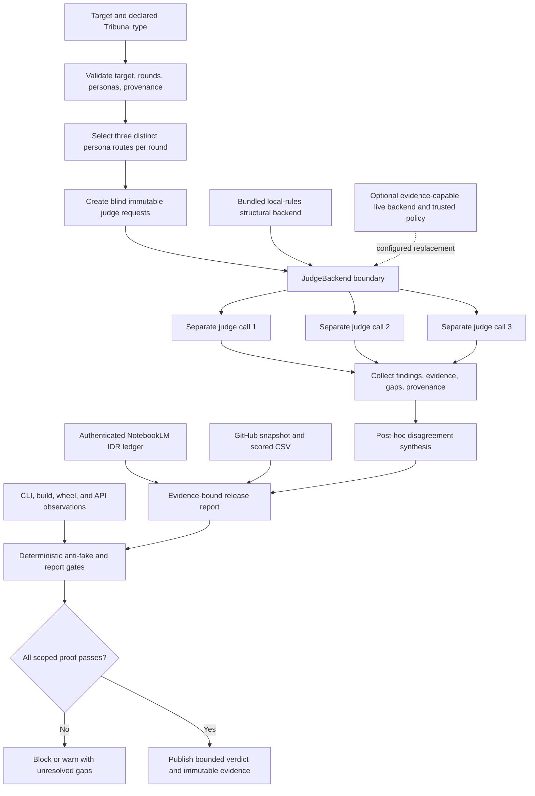

# Codex Tribunal Library: live IDR and adversarial tribunal

Audit date: `2026-07-20`

Declared use case: a reusable, hard-critical review layer for knowledge/correctness, critique/risk, and UI/UX feasibility, with blind initial views, explicit evidence gaps, a disclosed Karpathy-inspired critic, stable CLI/API output, and low-friction OSS reuse.

**Final verdict:** ship Codex Tribunal for the bounded offline orchestration and reusable-skill scope. Keep it thin and compose mature OSS for adversarial CI, live runtimes, and observability. Do not represent the bundled backend as semantic verification, visual testing, provider-family independence, or a production trace platform.

The single crown below is a narrow, project-authored fit assessment backed by the published rubric and deterministic gates. It is not an independent benchmark, community validation, a runtime semantic score, or a claim of universal product superiority.

## IDR

IDR: ja

- Canonical NotebookLM notebook: https://notebooklm.google.com/notebook/80cffd38-0185-4f4d-ae00-bbc67c4bc515
- Authenticated identity, title `Tribunal IDR 2026-07-04`, and public-link sharing were reverified with `nlm 0.8.9`; closing inventory was recorded at `2026-07-20T22:18:25Z`.
- Direct baseline inventory was `640` total, `598` processed, and `42` failed. The shared notebook changed during collection; the closing direct inventory was `669` total, `600` processed, and `69` failed.
- Twelve local-file uploads, twelve text submissions, and one public SHA-pinned URL path were attempted for fresh current sources. File uploads were rejected; text submissions later appeared as 24 empty/duplicate failed records; and the HTTP-reachable URL was rejected by NotebookLM. No fresh failed record is represented as processed grounding.
- Four cross-topic queries ran against 29 already processed primary, research-control, and same-day project sources. Knowledge returned 22 source IDs and 58 citation mappings. Critique, UX, and contradiction control returned complete prose but zero formal source/citation metadata and are treated as ungrounded model characterization.
- The contradiction control rejected nine overclaims and supported only the package-metadata claim. Current executable controls overruled a repeated false assertion that `LocalRulesBackend.evaluate` was missing.

The authoritative source IDs, ingestion failures, four query contracts, grounding counts, control labels, and manual corrections are retained in [`evidence/revalidation-notebooklm.md`](evidence/revalidation-notebooklm.md). Historical IDR ledgers remain reference material, not current proof.

## Method

1. **OpenSpec-first contract.** This run was specified before external calls in [`../openspec/changes/revalidate-trib-codex-trib-lib-brief/`](../openspec/changes/revalidate-trib-codex-trib-lib-brief/): proposal, design, capability scenarios, and 35 checkable tasks. Earlier completed changes remain historical inputs.
2. **Canonical live research.** The authenticated notebook and public link were verified, source state was inventoried twice, three source-ingestion approaches were attempted and truthfully failed, and four queries ran against 29 selected processed sources.
3. **OSS before custom work.** Eleven viable repositories were refreshed in one primary GitHub REST batch. Stars, licenses, archive/disabled state, activity, canonical URLs, README status, and the six score components were checked; stars provide zero points.
4. **Blind adversarial judgments.** Three mandated Grok sessions were attempted first. After all returned 402 before output, authorized `agy` fallbacks used separate fresh role sessions and a conclusion-free common packet. Synthesis started only after outputs were frozen.
5. **Adversarial controls.** Generated claims were reconciled against exact code, unit/compile/build gates, a malformed-input case, source CLI modes, an exact-wheel install, the installed console, and the installed Python API.
6. **Scoped implementation.** The first current build exposed setuptools license-metadata deprecations. The package moved to PEP-639/SPDX metadata and a `setuptools>=77` build floor; the clean rebuild removed the warnings without changing runtime dependencies.
7. **Fail-closed publication.** Unit, compile, build, skill, CSV, report, OpenSpec, evidence-link, diff, remote-SHA, and immutable-blob checks gate release.

NotebookLM synthesis, external judge opinion, GitHub primary metadata, and executable package behavior are separate evidence classes. None substitutes for another.

## Source inventory

### Research and evaluation sources

The selected processed set included canonical repository sources for:

- promptfoo: https://github.com/promptfoo/promptfoo
- DeepEval: https://github.com/confident-ai/deepeval
- DSPy: https://github.com/stanfordnlp/dspy
- Langfuse: https://github.com/langfuse/langfuse
- Phoenix: https://github.com/Arize-ai/phoenix
- AutoGen: https://github.com/microsoft/autogen
- Microsoft Agent Framework: https://github.com/microsoft/agent-framework
- Ragas: https://github.com/vibrantlabsai/ragas
- OpenAI Evals: https://github.com/openai/evals
- lm-evaluation-harness: https://github.com/EleutherAI/lm-evaluation-harness

The 29-source query set also contained NN/g usability heuristics; Agent-as-a-Judge, position-bias, sycophancy, and auditability research; nine same-day Tribunal project snapshots; four brief OpenSpec snapshots; and one executable contradiction-control snapshot. The project snapshots bind to earlier same-day commit `2c27f51`, so current executable behavior outranks any stale difference.

### Live metadata evidence

GitHub metadata was refreshed concurrently and timestamped only after all eleven primary REST calls completed: `2026-07-20T22:08:10Z`. The machine-readable record is [`evidence/github-snapshot.json`](evidence/github-snapshot.json), the score record is [`codex-trib-lib-matrix.csv`](codex-trib-lib-matrix.csv), and current batch/license/rubric evidence is in [`evidence/revalidation-oss.md`](evidence/revalidation-oss.md). Root-license reads reconfirmed AutoGen's CC-BY-4.0 and maintenance notice, OpenAI Evals' dataset exceptions, Langfuse's enterprise-directory exclusions, and Phoenix's Elastic License 2.0 hosted-service restriction.

### Evidence-quality rule

Primary documentation and current executable behavior outrank generated characterizations. A processed source is not automatically interpreted correctly, an accepted source-add command is not proof of later processing, a valid NotebookLM URL is not proof of a query, and an empty model-declared gap list is not verified truth.

## NotebookLM cross-query synthesis

| Query | Returned grounding metadata | Decision-relevant result | Manual correction/control |
|---|---:|---|---|
| Knowledge/correctness | 22 source IDs, 58 citation mappings | Supports the thin structural contract, persona disclaimer, package metadata, explicit local-backend limits, and OSS composition. | Historical provider facts and study metrics remain source descriptions, not current measurements. |
| Harsh criticism/risk | 0 source IDs, 0 mappings | Raises common-mode, injection/sycophancy, backend-trust, provider-provenance, durable budget/trace, license, and identity risks. | Filename-style brackets did not become formal grounding; prose is advisory only. |
| CLI UX/feasibility | 0 source IDs, 0 mappings | Identifies discoverability, bounded input/errors, serialization/provenance, workflow friction, persona disclosure, and external visual proof needs. | Rejected the invented missing-`evaluate` blocker through current source and installed execution. |
| Contradiction/source attribution | 0 source IDs, 0 mappings | Rejected semantic local-rules, automatic independence, URL-equals-query, visual pass, real-person authorship, crown/runtime equivalence, durable quota, identical Markdown/JSON, and snapshot-only install proof; supported package declarations. | Formal grounding was empty; compile/build/wheel/CLI/API observations are authoritative. |

All four responses shared one NotebookLM conversation ID, so this pass claims cross-topic querying, not isolated conversations.

IDR conclusion: the corpus supports Tribunal as an honest structural contract and extension point. It does not support native semantic verification, visual accessibility testing, provider-family independence, durable quota/trace enforcement, or production calibration.

## Tribunal verdict 1: Knowledge and correctness

**Engine:** brief-approved `agy` fallback / `Gemini 3.1 Pro (High)`

**Run:** fresh isolated read-only plan session against the revalidation conclusion-free packet

**Score:** `95/100`

**Recommendation:** Ship with conditions

The judge found no current core defect. It directly supported the structural/semantic boundary, dependency-free runtime, bounded CLI, package entry point/data declarations, persona disclaimer, and syntactic-only NotebookLM provenance. Its controlling conditions are to keep `local-rules` visibly non-semantic, use real live backends for substantive review, preserve the identity disclaimer, and keep visual UX outside a terminal-only proof.

Accepted verdict: [`evidence/revalidation-judge-knowledge.md`](evidence/revalidation-judge-knowledge.md).

## Tribunal verdict 2: Harsh critique and risks

**Engine:** brief-approved `agy` fallback / `Gemini 3.5 Flash (High)`

**Run:** fresh restricted-project read-only plan session against the common packet

**Score:** `70/100`

**Recommendation:** Ship with conditions

The hostile judge stressed the self-authored external matrix, UI/UX capability semantics, sequential live-backend latency, syntactic NotebookLM scoring, backend self-declaration, missing family enforcement, synthetic-persona downstream risk, and absence of bundled semantic adapters.

Synthesis accepts those as boundaries or production risks, with three corrections:

- `UI/UX ✅` means native review-mode/persona/gap-contract fit, not browser rendering or accessibility success.
- A one-person `--personas` request returning concise exit 2 is an intended three-judge contract, not a crash.
- Routing/engine/hardness strings appended to the evidence array are explicit orchestrator provenance, not backend-authored target evidence.

Accepted verdict: [`evidence/revalidation-judge-critique.md`](evidence/revalidation-judge-critique.md).

## Tribunal verdict 3: UX and implementability

**Engine:** brief-approved `agy` fallback / `Gemini 3.5 Flash (Medium)`

**Run:** final fresh restricted-project read-only plan retry after the first UX fallback was quota-blocked and a second returned no verdict

**Score:** `94/100`

**Recommendation:** Ship with conditions

The UX judge reproduced current setuptools license-metadata deprecations, flagged the generic top-level `personas` namespace, documented Markdown newline flattening, persona discovery friction, and the lack of bundled live adapters. This pass fixed the actionable non-breaking packaging warning with PEP-639/SPDX metadata and verified a warning-free rebuild. Markdown flattening is an intentional documented safe-rendering choice, persona listing/adapters are optional, and renaming the top-level persona package requires an explicit breaking migration.

The verdict remains a CLI/package feasibility view, not browser, viewport, accessibility, or human-task validation.

Accepted verdict: [`evidence/revalidation-judge-ux.md`](evidence/revalidation-judge-ux.md).

## Debate and synthesis

### Required Grok path and truthful fallback

Three separate fresh commands used the required form:

```text
grok --single <role-specific prompt> -m grok-4.5 --effort high
```

All failed before model output with HTTP 402, `Grok Build usage balance exhausted`. No Grok prose exists.

The authorized fallback sequence was: Gemini 3.1 Pro High completed knowledge; Claude Sonnet 4.6 Thinking and GPT-OSS 120B Medium were individually quota-blocked before output; Gemini 3.5 Flash High completed criticism; Gemini 3.5 Flash Low returned only procedural narration and was excluded; Gemini 3.5 Flash Medium completed UX.

The accepted set proves separate fresh sessions, role prompts, conclusion-free packet isolation, and file-scope attestation. All accepted verdicts are Gemini-family models, so no provider-family diversity, statistical independence, provider-memory isolation, or correlated-bias control is claimed. Full provenance: [`evidence/revalidation-external-attempts.md`](evidence/revalidation-external-attempts.md).

### Agreements

- The dependency-free core is coherent as structural orchestration plus a backend seam.
- `local-rules` is not semantic fact checking, visual inspection, NotebookLM retrieval, live quota discovery, or family enforcement.
- Unique personas and separate calls are useful blind routing but insufficient proof of independent errors.
- Bounded input/errors, JSON provenance, explicit gaps, packaging, and disclaimer preservation are strong.
- Production use requires real provider/model provenance, trusted backend gaps, injection controls, calibration, durable budgets/traces, and external visual/executable evidence.

### Material disagreements

- The knowledge judge treated the published boundary as highly credible; the critique judge deducted heavily because the matrix is self-authored and backends self-declare scores/gaps. Both are retained: the matrix is mechanically consistent but not an independent benchmark, and the backend is a trust boundary.
- The critique judge interpreted `UI/UX ✅` as a visual green result. The matrix definition is narrower, but the report now repeats that limitation at the table and verdict.
- The critique judge called the mandatory three-person validation and orchestrator provenance evidence pollution defects. Current code/tests treat them as deliberate, documented contracts.
- The UX judge's packaging deprecation was reproduced and fixed. Its namespace-collision risk remains real but requires a separately planned breaking migration.
- All three judges accept that semantic verification, family diversity, persistent trace/budget state, and visual proof are external to the thin core.

### Synthesized verdict

Scores `95/100`, `70/100`, and `94/100` are not averaged because the roles assessed different surfaces and share one model family. No accepted judge reproduced a blocking runtime defect in the declared CLI/API/skill contract. One actionable packaging defect was reproduced and fixed. Subject to deterministic gates and immutable publication, Codex Tribunal is fit to ship as an auditable offline orchestration contract and reusable skill; production semantic judgment remains an integration. Full finding disposition: [`evidence/revalidation-synthesis.md`](evidence/revalidation-synthesis.md).

## 100-point rubric

| Dimension | Weight | High-score anchor | Anti-gaming rule |
|---|---:|---|---|
| Type Fit | 25 | Native coverage of knowledge, critique, and UI/UX plus isolated initial views | Generic evaluation or tracing receives partial credit only |
| Adversarial Depth | 20 | Specialized judges, blind initial verdicts, bias controls, heterogeneous boundaries | Role labels alone are not independence |
| Evidence | 20 | Primary/executable proof, citations, explicit gaps, rerunnable gates | Stars and unsupported prose receive zero evidence points |
| Extensibility | 15 | Validated/discoverable personas, reusable skills, backend/plugin seams | A generic callback without routing receives partial credit |
| Repeatability | 10 | Stable schemas, deterministic reruns, traces, pinned provenance | Screenshots or unrecorded sessions do not count |
| Integration | 10 | Small dependency/security surface and clear embedding contract | Missing integrations are not automatically a benefit |

Every component is an integer bounded by its weight; all six components sum to the total. Stars add zero points. A deterministic-gate failure, fabricated provenance, hidden category mismatch, or winning score below 70 vetoes the winner marker.

This comparative score is not the runtime `local-rules` score. The matrix rates repository fit for the declared six-dimension use case using external research and executable evidence; `local-rules` rates only one invocation's structural setup and is deliberately capped at `40/50`. Neither score is semantic truth, and a runtime `⚠️` does not become a runtime crown because the separate OSS matrix crowns the strongest bounded product fit.

### Score breakdown

| Rank | Tool | Fit /25 | Adversarial /20 | Evidence /20 | Extensibility /15 | Repeatability /10 | Integration /10 | Total |
|---:|---|---:|---:|---:|---:|---:|---:|---:|
| 1 | Codex Tribunal | 25 | 13 | 18 | 15 | 7 | 7 | 85/100 |
| 2 | promptfoo | 15 | 16 | 18 | 11 | 10 | 8 | 78/100 |
| 3 | Microsoft Agent Framework | 17 | 12 | 12 | 15 | 10 | 6 | 72/100 |
| 4 | DeepEval | 13 | 12 | 17 | 10 | 9 | 7 | 68/100 |
| 5 | AutoGen | 16 | 14 | 10 | 14 | 6 | 4 | 64/100 |
| 6 | Ragas | 11 | 8 | 17 | 9 | 9 | 7 | 61/100 |
| 7 | OpenAI Evals | 10 | 7 | 17 | 8 | 10 | 7 | 59/100 |
| 8 | Langfuse | 8 | 6 | 18 | 10 | 10 | 6 | 58/100 |
| 9 | DSPy | 9 | 8 | 12 | 14 | 8 | 6 | 57/100 |
| 10 | Phoenix | 8 | 6 | 18 | 10 | 10 | 4 | 56/100 |
| 11 | lm-evaluation-harness | 7 | 5 | 18 | 7 | 10 | 6 | 53/100 |

## OSS feature matrix

Snapshot completed UTC: `2026-07-20T22:08:10Z`. Capability cells mean verified/native fit for the declared comparison (`✅`), partial/composable fit (`⚠️`), or absent fit (`❌`); they are not semantic target scores or visual test passes. Scores and unformatted star values are duplicated here for human review; the CSV is authoritative and mechanically gated.

| Rank | Tool | GitHub repository | Stars | License qualification | Knowledge | Critique | UI/UX | Independent judges | Evidence | Persona/skill | Repeatability | Score | Result |
|---:|---|---|---:|---|:---:|:---:|:---:|:---:|:---:|:---:|:---:|---:|:---:|
| 1 | Codex Tribunal | https://github.com/Martin-Hausleitner/tribunal-public | 0 | MIT | ✅ | ✅ | ✅ | ⚠️ | ✅ | ✅ | ⚠️ | 85/100 | 👑 |
| 2 | promptfoo | https://github.com/promptfoo/promptfoo | 23,446 | MIT | ✅ | ✅ | ⚠️ | ❌ | ✅ | ⚠️ | ✅ | 78/100 |  |
| 3 | Microsoft Agent Framework | https://github.com/microsoft/agent-framework | 12,252 | MIT | ⚠️ | ⚠️ | ⚠️ | ⚠️ | ⚠️ | ✅ | ✅ | 72/100 |  |
| 4 | DeepEval | https://github.com/confident-ai/deepeval | 16,982 | Apache-2.0 | ✅ | ⚠️ | ❌ | ❌ | ✅ | ⚠️ | ✅ | 68/100 |  |
| 5 | AutoGen | https://github.com/microsoft/autogen | 59,850 | CC-BY-4.0; maintenance mode; component-specific review | ⚠️ | ⚠️ | ⚠️ | ⚠️ | ⚠️ | ✅ | ⚠️ | 64/100 |  |
| 6 | Ragas | https://github.com/vibrantlabsai/ragas | 14,918 | Apache-2.0 | ✅ | ⚠️ | ❌ | ❌ | ✅ | ⚠️ | ✅ | 61/100 |  |
| 7 | OpenAI Evals | https://github.com/openai/evals | 18,955 | MIT code; dataset licenses vary | ✅ | ⚠️ | ❌ | ❌ | ✅ | ⚠️ | ✅ | 59/100 |  |
| 8 | Langfuse | https://github.com/langfuse/langfuse | 31,512 | MIT except declared enterprise directories | ⚠️ | ⚠️ | ❌ | ❌ | ✅ | ⚠️ | ✅ | 58/100 |  |
| 9 | DSPy | https://github.com/stanfordnlp/dspy | 36,261 | MIT | ⚠️ | ⚠️ | ❌ | ❌ | ⚠️ | ✅ | ✅ | 57/100 |  |
| 10 | Phoenix | https://github.com/Arize-ai/phoenix | 10,642 | Elastic-2.0; source-available, not OSI open source | ⚠️ | ⚠️ | ❌ | ❌ | ✅ | ⚠️ | ✅ | 56/100 |  |
| 11 | lm-evaluation-harness | https://github.com/EleutherAI/lm-evaluation-harness | 13,341 | MIT | ✅ | ❌ | ❌ | ❌ | ✅ | ⚠️ | ✅ | 53/100 |  |

The ranking is deliberately use-case-specific. promptfoo is stronger for ready-made adversarial assertions and CI regression. Microsoft Agent Framework is stronger for production multi-agent workflow runtime. DeepEval and Ragas provide richer evaluation metrics. Langfuse and Phoenix are stronger telemetry/experiment surfaces. DSPy is stronger for language-model program optimization. OpenAI Evals and lm-evaluation-harness are stronger established eval/benchmark runners.

## Verdict and recommendation

**Winner for the declared narrow use case: Codex Tribunal, `85/100`.** This is the project-authored, evidence-backed rubric result, not an externally calibrated benchmark. It wins on direct three-mode fit, blind per-persona backend calls, explicit gaps, a validated persona library, the disclosed implementation-first critic, the reusable skill, transparent local behavior, stable JSON/Markdown, and a zero-runtime-dependency install. The deductions are intentional: no family-diversity enforcement, calibration/bias probes, durable trace store, or bundled live backend.

The OSS-first recommendation is composition, not reinvention:

1. Keep Tribunal as the small review-control, provenance, and output contract.
2. Use promptfoo for red-team cases, assertion catalogs, and CI regression instead of building another evaluator catalog.
3. Use Microsoft Agent Framework when the deployment needs production multi-agent workflows, checkpoints, human-in-the-loop control, or broader provider orchestration.
4. Use Langfuse or another vetted observability platform for durable live traces rather than embedding a trace database here.
5. Inject a narrow evidence-capable provider backend only where semantic judging is required, and record actual provider/model/version, prompt/rubric identity, costs, citations, and gaps.
6. Keep executable, browser, accessibility, and security checks outside judge opinion and feed their observations into the verdict as evidence.

The Karpathy-inspired persona is intentionally direct and non-sycophantic: it rejects unnecessary abstraction and demands small understandable code plus runnable proof. “Uncensored” means hard criticism, not impersonation, harassment, unsafe instruction, or invented attribution. The persona is synthetic, neither authored nor endorsed by Andrej Karpathy, and its disclaimer now travels with standalone JSON and Markdown views.

## Implementation plan

### Delivered in this release

1. **Core contract:** `knowledge`, `critique`, `ui_ux`, and comparison modes; three persona slots per round; bounded Nx/hardness; isolated immutable judge requests; strict backend result validation; post-hoc synthesis.
2. **Persona library and skill:** nine validated JSON personas; public GitHub references; explicit role, stance, skill labels, reference input, and optional disclaimer; disclosed Karpathy-inspired implementation critic; reusable hard-criticism workflow.
3. **Operator and safety behavior:** concise expected CLI errors; stable JSON/Markdown; target and backend-output Markdown neutralization; positive markers only when every view reaches 80 and declares no gaps; bounded rounds/target length.
4. **Packaging:** PEP 517/PEP 639 project metadata, SPDX MIT expression, explicit license file, console script, bundled persona JSON, dependency-free runtime, and a warning-free current setuptools build.
5. **Live evidence:** authenticated NotebookLM IDR with failed-ingestion provenance and contradiction controls; three isolated accepted fallback verdicts after truthful Grok/quota/incomplete exclusions; live GitHub metadata; differentiated 100-point scoring; one winner.
6. **Anti-drift controls:** persona disclaimer serialized in judge views and Markdown; routed skill labels described as host responsibilities; report validation joined to the sibling CSV's snapshot, tools, URLs, scores, and winner; generated false blockers rejected by current source and exact-wheel proof.

### Real E2E proof

A realistic comparison asked whether Tribunal should remain the narrow review contract while composing promptfoo, Microsoft Agent Framework, and Langfuse for mature external capability:

```bash
python tribunal.py \
  --mode comparison \
  --rounds 2 \
  --hardness hard \
  --target "Decide whether Codex Tribunal should remain the narrow review contract while composing promptfoo, Microsoft Agent Framework, and Langfuse for mature external capabilities" \
  --notebooklm-url https://notebooklm.google.com/notebook/80cffd38-0185-4f4d-ae00-bbc67c4bc515 \
  --json
```

Source-tree observations: exit `0`; requested/effective rounds `2/2`; hardness `hard`; six isolated views; `local-rules` from `builtin-local`; two explicit gaps per view; final `50/100`; marker `⚠️`, not a runtime winner. Knowledge, critique, and UI/UX each returned `40/100`, `⚠️`, three views, and two gaps per view. The malformed-host NotebookLM case returned exit `2`, concise stderr, and no traceback.

The initial PEP 517 build reproduced setuptools license-metadata deprecations. After the PEP-639/SPDX fix, a fresh isolated build exited `0` with no deprecation, emitted an sdist and wheel, and recorded `License-Expression: MIT` plus `License-File: LICENSE`. Wheel SHA-256: `082b979c0806d338c15f44d6d4337e01849181e19b411fdb7947ebbb755deae4`. Sdist SHA-256: `b01773ede8b01d94200941636c2b11cf59320ddd0fd841e660cdec63f63e0e82`.

The exact wheel was installed with `--no-deps` into an isolated environment. From outside the repository:

- the installed `tribunal` console repeated the two-round comparison and all bounded evidence gaps;
- the imported module resolved to isolated `site-packages/tribunal.py`;
- the installed Python API returned critique, `40/100`, `⚠️`, three `local-rules` views, and gaps `[2, 2, 2]`;
- JSON and Markdown both preserved the synthetic persona's neither-authored-nor-endorsed disclaimer;
- the wheel listed `tribunal.py`, console metadata, the license, `personas/__init__.py`, and all nine persona JSON files.

The first installed-API driver looked for the wrong key `backend_name` and was excluded; the stable field is `backend`, and the corrected driver passed. Full current proof: [`evidence/revalidation-e2e-2026-07-20.md`](evidence/revalidation-e2e-2026-07-20.md).

### Recommended next increments

1. Place live-provider adapters in a separate package and record immutable provider/model/version, prompt/rubric, latency, token/cost, source, and error provenance.
2. Add an opt-in policy that requires distinct provider/model families and fails closed when observed provenance is insufficient. Call this diversity enforcement, not statistical independence.
3. Calibrate judge behavior with pair-order swaps, formatting perturbations, adversarial fixtures, and disagreement thresholds before using scores for high-stakes automation.
4. Put durable budgets, retry state, trace persistence, and prompt-injection controls at a trusted execution boundary.
5. If a visual product is added, test real viewports, keyboard navigation, semantics, contrast, error recovery, and repeated operator tasks before any UI/UX pass.
6. Before a breaking major release, assess migration of the generic top-level `personas` package into a project namespace and provide an explicit compatibility plan rather than a silent rename.



## Limitations

- The bundled `local-rules` backend checks structure only. Its `40/100` result without a notebook reference and `50/100` with one are transparent readiness markers, not target-quality scores.
- NotebookLM URL validation checks syntax only. This pass separately authenticated and queried the notebook, but all three fresh-source ingestion approaches failed; only 29 already processed selected sources grounded queries.
- The shared NotebookLM corpus is concurrently mutable, duplicated, and mixed quality. Closing direct inventory was `669/600/69`; only the knowledge query returned formal grounding metadata, while three other answers returned zero source/citation mappings.
- A custom backend can route every request to one model and self-declare scores and empty gaps. The library records claims/provenance but cannot make them independently true.
- All accepted external verdicts are Gemini-family models in separate sessions. Grok 4.5 failed three times with HTTP 402; Claude Sonnet and GPT-OSS were quota-blocked; one Gemini Low UX run was incomplete. Process isolation is not provider-family or statistical independence.
- Synthesis is post-hoc. Judges do not inspect or answer sibling arguments through the current `JudgeRequest` contract.
- Live backend calls are evaluated synchronously. Production adapters must account for latency, cancellation, rate limits, retries, and trusted concurrency outside this core.
- Arbitrary backend Markdown is normalized and flattens whitespace; JSON is lossless. Rendering hardening is not downstream prompt-injection protection.
- No TUI/web UI exists. CLI proof cannot establish visual polish, responsive layout, contrast, keyboard/screen-reader behavior, interaction quality, or end-user task success.
- Routed skill names are declared labels. The core does not discover or invoke installed Codex skills; the host must enforce that boundary.
- Capacity values are per-run judge slots, not tokens, live quotas, billing controls, or persistent budgets.
- Persona rotation is deterministic. Nine bundled personas repeat after three complete rounds; an explicit three-person panel repeats each round.
- The installable top-level `personas` package has a potential generic namespace collision. Renaming it requires a planned breaking migration.
- GitHub stars are mutable adoption signals and provide zero points. License summaries are repository-level observations, not legal advice.
- The Karpathy-inspired critic is synthetic and cannot attribute generated judgments to the real person.

## Reproduction

Run from the repository root with Python 3.10 or newer:

```bash
python -m unittest discover -s tests -v
python -m py_compile tribunal.py personas/__init__.py scripts/csv_gate.py scripts/report_gate.py scripts/skill_gate.py tests/test_tribunal.py examples/e2e_demo.py examples/phase1_core_modes.py
python scripts/skill_gate.py skill/SKILL.md
python scripts/csv_gate.py report/codex-trib-lib-matrix.csv
python scripts/report_gate.py report/codex-trib-lib-tribunal.md
openspec validate live-audit-codex-tribunal-library --strict
openspec validate revalidate-live-codex-tribunal-library --strict
openspec validate complete-live-codex-tribunal-library-brief --strict
openspec validate revalidate-trib-codex-trib-lib-brief --strict
python -m build
python examples/phase1_core_modes.py
python examples/e2e_demo.py
```

Clean-install proof:

```bash
python -m venv /tmp/tribunal-live-audit-venv
/tmp/tribunal-live-audit-venv/bin/python -m pip install .
cd /tmp
/tmp/tribunal-live-audit-venv/bin/tribunal --mode knowledge --target "Installed package E2E" --json
```

Evidence index:

- Current OpenSpec/guard/tool baseline: [`evidence/revalidation-baseline.md`](evidence/revalidation-baseline.md)
- Current authenticated NotebookLM IDR: [`evidence/revalidation-notebooklm.md`](evidence/revalidation-notebooklm.md)
- Current primary OSS snapshot and rubric check: [`evidence/revalidation-oss.md`](evidence/revalidation-oss.md)
- Current frozen conclusion-free judge packet: [`evidence/revalidation-judge-packet.md`](evidence/revalidation-judge-packet.md)
- Current Grok/fallback attempts and exclusions: [`evidence/revalidation-external-attempts.md`](evidence/revalidation-external-attempts.md)
- Current accepted knowledge, criticism, and UX verdicts: [`evidence/revalidation-judge-knowledge.md`](evidence/revalidation-judge-knowledge.md), [`evidence/revalidation-judge-critique.md`](evidence/revalidation-judge-critique.md), [`evidence/revalidation-judge-ux.md`](evidence/revalidation-judge-ux.md)
- Current synthesis and finding disposition: [`evidence/revalidation-synthesis.md`](evidence/revalidation-synthesis.md)
- Current source/build/wheel/console/API proof: [`evidence/revalidation-e2e-2026-07-20.md`](evidence/revalidation-e2e-2026-07-20.md)

- Baseline and tool/authentication record: [`evidence/live-audit-baseline.md`](evidence/live-audit-baseline.md)
- Final revalidation baseline: [`evidence/final-revalidation-baseline.md`](evidence/final-revalidation-baseline.md)
- NotebookLM live IDR: [`evidence/notebooklm-live-audit.md`](evidence/notebooklm-live-audit.md)
- NotebookLM revalidation and contradiction control: [`evidence/notebooklm-revalidation.md`](evidence/notebooklm-revalidation.md)
- Final NotebookLM inventory and cross-query audit: [`evidence/final-notebooklm-revalidation.md`](evidence/final-notebooklm-revalidation.md)
- Frozen blind judge packet: [`evidence/live-audit-judge-packet.md`](evidence/live-audit-judge-packet.md)
- Frozen revalidation packet: [`evidence/revalidation-judge-packet.md`](evidence/revalidation-judge-packet.md)
- Final frozen judge packet: [`evidence/final-revalidation-judge-packet.md`](evidence/final-revalidation-judge-packet.md)
- Grok failures, fallback provenance, and discarded attempts: [`evidence/live-audit-grok-attempts.md`](evidence/live-audit-grok-attempts.md)
- Revalidation Grok/agy attempts: [`evidence/revalidation-external-attempts.md`](evidence/revalidation-external-attempts.md)
- Final Grok/agy attempts and exclusions: [`evidence/final-revalidation-external-attempts.md`](evidence/final-revalidation-external-attempts.md)
- Knowledge verdict: [`evidence/live-audit-judge-knowledge.md`](evidence/live-audit-judge-knowledge.md)
- Additional revalidation knowledge verdict: [`evidence/revalidation-judge-knowledge.md`](evidence/revalidation-judge-knowledge.md)
- Final knowledge verdict: [`evidence/final-revalidation-judge-knowledge.md`](evidence/final-revalidation-judge-knowledge.md)
- Final harsh-critique verdict: [`evidence/final-revalidation-judge-critique.md`](evidence/final-revalidation-judge-critique.md)
- Final UX verdict: [`evidence/final-revalidation-judge-ux.md`](evidence/final-revalidation-judge-ux.md)
- Harsh-critique verdict: [`evidence/live-audit-judge-critique.md`](evidence/live-audit-judge-critique.md)
- UX verdict: [`evidence/live-audit-judge-ux.md`](evidence/live-audit-judge-ux.md)
- Frozen synthesis and finding disposition: [`evidence/live-audit-synthesis.md`](evidence/live-audit-synthesis.md)
- Final synthesis and finding disposition: [`evidence/final-revalidation-synthesis.md`](evidence/final-revalidation-synthesis.md)
- GitHub metadata: [`evidence/github-snapshot.json`](evidence/github-snapshot.json)
- Machine-readable matrix: [`codex-trib-lib-matrix.csv`](codex-trib-lib-matrix.csv)
- Public CLI/package proof: [`evidence/live-audit-e2e.md`](evidence/live-audit-e2e.md)
- Fresh CLI/API/installed-package proof: [`evidence/revalidation-e2e.md`](evidence/revalidation-e2e.md)
- Final source/build/wheel/CLI/API proof: [`evidence/final-revalidation-e2e.md`](evidence/final-revalidation-e2e.md)

The release is complete only when these exact artifacts pass the gates, are committed together, the branch push contains that commit, and the final report is retrievable at a SHA-pinned public GitHub blob URL.
