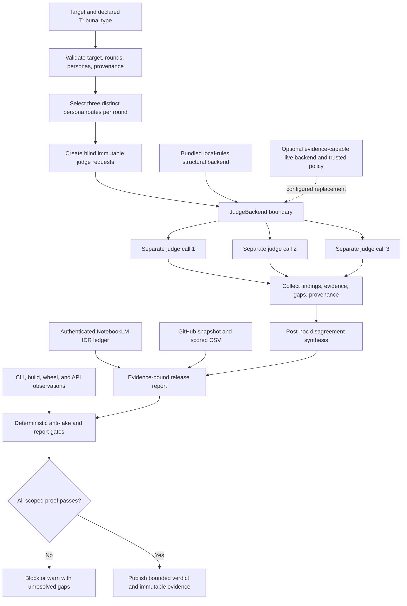

# Codex Tribunal Library: live IDR and adversarial tribunal

Audit date: `2026-07-20`

Declared use case: a reusable, hard-critical review layer for knowledge/correctness, critique/risk, and UI/UX feasibility, with blind initial views, explicit evidence gaps, a disclosed Karpathy-inspired critic, stable CLI/API output, and low-friction OSS reuse.

**Final verdict:** ship Codex Tribunal for the bounded offline orchestration and reusable-skill scope. Keep it thin and compose mature OSS for adversarial CI, live runtimes, and observability. Do not represent the bundled backend as semantic verification, visual testing, provider-family independence, or a production trace platform.

The single crown below is a narrow, project-authored fit assessment backed by the published rubric and deterministic gates. It is not an independent benchmark, community validation, a runtime semantic score, or a claim of universal product superiority.

## IDR

IDR: ja

- Canonical NotebookLM notebook: https://notebooklm.google.com/notebook/80cffd38-0185-4f4d-ae00-bbc67c4bc515
- Authenticated identity, title `Tribunal IDR 2026-07-04`, and public-link sharing were reverified with `nlm 0.8.9`; the verification ledger was recorded at `2026-07-20T22:14:42Z`.
- Direct baseline inventory was `640` total, `598` processed, and `42` failed. The shared notebook changed during collection; the closing direct inventory was `669` total, `600` processed, and `69` failed.
- Four current planning files were offered as fresh sources. Proposal and design were processed; the nested spec/task uploads returned `INVALID_ARGUMENT`, a materially different inline bundle later failed, and a direct-control upload was rejected. Failed records were excluded from every query.
- A default-conversation knowledge attempt returned `0` selected sources and `0` mappings and was excluded. Four accepted cross-topic queries then used separate fresh conversation IDs and explicit processed-source selections: knowledge `17/72`, critique `6/22`, UX `11/40`, and contradiction control `6/23` returned source IDs/citation mappings.
- NotebookLM repeatedly invented syntax, import, regex, delimiter, and missing-method defects from normalized passages. Exact source, compiler, import, rendering, CLI, build, and installed-wheel controls overruled them. The contradiction control accepted those executable facts as external evidence rather than pretending they were notebook citations.

The authoritative source IDs, ingestion failures, rejected attempt, four query contracts, grounding counts, control labels, and manual corrections are retained in [`evidence/verification-notebooklm.md`](evidence/verification-notebooklm.md). Historical IDR ledgers remain reference material, not current proof.

## Method

1. **OpenSpec-first contract.** This run was specified and strictly validated before fresh synthesis in [`../openspec/changes/verify-complete-codex-tribunal-library-brief/`](../openspec/changes/verify-complete-codex-tribunal-library-brief/): proposal, design, capability scenarios, and 53 checkable tasks. Earlier completed changes remain historical inputs.
2. **Canonical live research.** The authenticated notebook and public link were verified, mutable source state was inventoried, two fresh current planning sources reached processed status, failures were excluded, and four accepted queries used explicit selected sources plus fresh conversation IDs.
3. **OSS before custom work.** Eleven viable repositories were refreshed in one primary GitHub REST batch. Stars, licenses, archive/disabled state, activity, canonical URLs, README status, and the six score components were checked; stars provide zero points.
4. **Blind adversarial judgments.** The weekly guard was above its 50% threshold, so no expensive Codex/OMX burst was started. The brief-authorized `agy` alternative used three accepted fresh role sessions and one conclusion-free common packet. Synthesis started only after outputs were frozen.
5. **Adversarial controls.** Generated claims were reconciled against exact code, unit/compile/build gates, a malformed-input case, source CLI modes, an exact-wheel install, the installed console, and the installed Python API.
6. **Scoped implementation.** The hostile judge reproduced that canonical NotebookLM URLs still accepted query strings and fragments. Final E2E additionally reproduced acceptance of the literal `<id>` documentation token. The validator and regression test now reject both defect classes while retaining real UUID/slug forms.
7. **Fail-closed publication.** Unit, compile, build, skill, CSV, report, OpenSpec, evidence-link, diff, remote-SHA, and immutable-blob checks gate release.

NotebookLM synthesis, external judge opinion, GitHub primary metadata, and executable package behavior are separate evidence classes. None substitutes for another.

## Source inventory

### Research and evaluation sources

The selected processed set included canonical repository sources for:

- promptfoo: https://github.com/promptfoo/promptfoo
- DeepEval: https://github.com/confident-ai/deepeval
- DSPy: https://github.com/stanfordnlp/dspy
- Langfuse: https://github.com/langfuse/langfuse
- Phoenix: https://github.com/Arize-ai/phoenix
- AutoGen: https://github.com/microsoft/autogen
- Microsoft Agent Framework: https://github.com/microsoft/agent-framework
- Ragas: https://github.com/vibrantlabsai/ragas
- OpenAI Evals: https://github.com/openai/evals
- lm-evaluation-harness: https://github.com/EleutherAI/lm-evaluation-harness

Role-specific selected sets also contained Nielsen Norman Group usability heuristics, W3C WCAG 2.2 Quick Reference, multi-agent-debate research, an ACL position-bias study, current Tribunal project snapshots, and the two processed current-pass OpenSpec sources. The project sources bind to starting HEAD `9f1dc36`; current executable behavior and the final committed diff outrank any later difference.

### Live metadata evidence

GitHub metadata was refreshed concurrently and timestamped only after all eleven primary REST calls completed: `2026-07-20T22:17:14Z`. The machine-readable record is [`evidence/github-snapshot.json`](evidence/github-snapshot.json), the score record is [`codex-trib-lib-matrix.csv`](codex-trib-lib-matrix.csv), and current batch/license/rubric evidence is in [`evidence/verification-oss.md`](evidence/verification-oss.md). Root-license reads reconfirmed AutoGen's CC-BY-4.0 and maintenance notice, OpenAI Evals' dataset exceptions, Langfuse's enterprise-directory exclusions, and Phoenix's Elastic License 2.0 hosted-service restriction.

### Evidence-quality rule

Primary documentation and current executable behavior outrank generated characterizations. A processed source is not automatically interpreted correctly, an accepted source-add command is not proof of later processing, a valid NotebookLM URL is not proof of a query, and an empty model-declared gap list is not verified truth.

## NotebookLM cross-query synthesis

| Query | Returned grounding metadata | Decision-relevant result | Manual correction/control |
|---|---:|---|---|
| Knowledge/correctness | 17 source IDs, 72 citation mappings | Supports separate backend requests, deterministic persona/round routing, bounds, structural-only scoring, strict markers, and OSS composition. | Excluded normalized-source syntax claims, a `strict state machine` overstatement, and paper metrics misapplied as local results. |
| Harsh criticism/risk | 6 source IDs, 22 citation mappings | Retains common-mode, provider provenance, injection/bias calibration, persistent budgets, and unclaimed zipapp/PEX behavior as deployment pressure. | Excluded invented unterminated-string, collapsed-import, empty-regex, and empty-delimiter defects after exact controls. |
| CLI UX/feasibility | 11 source IDs, 40 citation mappings | Supports four discoverable modes, bounds, help/errors, serialization, disclosure, conventional packaging, and compose-over-build guidance. | Excluded invented syntax/missing-method blockers and a nonexistent Studio artifact; visual criteria were not treated as passed tests. |
| Contradiction/source attribution | 6 source IDs, 23 citation mappings | Correctly reclassified the repeated code blockers as normalization artifacts and separated structural scoring, retrieval, visual proof, independence, quotas, and identity. | Executable facts were explicitly labeled external controls; source provenance does not make generated interpretation authoritative. |

The rejected default-conversation answer had no selected grounding. Each accepted query used its own fresh conversation UUID, so no accepted query reused the default thread.

IDR conclusion: the corpus supports Tribunal as an honest structural contract and extension point. It does not support native semantic verification, visual accessibility testing, provider-family independence, durable quota/trace enforcement, or production calibration.

## Tribunal verdict 1: Knowledge and correctness

**Engine:** brief-approved `agy` fallback / `Gemini 3.1 Pro (High)`

**Run:** fresh isolated read-only plan session against packet SHA-256 `f5ad6478b25e1078e93b0250bc70630984100b608dc92211fc9f9bf423ba1d6d`

**Score:** `95/100`

**Recommendation:** Ship

The judge emphasized that lossy NotebookLM source normalization produced confident false code blockers and that executable/source controls must win. It confirmed the local `50/100` ceiling, the non-semantic boundary, and the Karpathy disclaimer. Its remaining gaps are mutable shared-corpus state, no semantic/visual retrieval in `local-rules`, and no statistical/provider-family independence.

Accepted verdict: [`evidence/verification-judge-knowledge.md`](evidence/verification-judge-knowledge.md).

## Tribunal verdict 2: Harsh critique and risks

**Engine:** brief-approved `agy` fallback / `Gemini 3.5 Flash (High)`

**Run:** fresh isolated read-only plan session against the same frozen packet

**Score:** `57/100`

**Recommendation:** Block

The hostile judge raised a generic top-level `personas` namespace, unclaimed zipapp/PEX resource behavior, Markdown metadata/whitespace handling, custom-backend self-declaration, persona repetition, and one concrete canonical-URL defect. It reported `18` passing tests, successful build/wheel inspection, and gate observations while still recommending a block.

Direct disposition preserves the hostile verdict while separating current defects from boundaries:

- Query strings and fragments were reproducibly accepted by the NotebookLM validator and are now rejected. Final E2E found and fixed the related `<id>` acceptance gap.
- The namespace risk is retained for a planned breaking migration; zipapp/PEX is not a claimed distribution surface.
- The `_markdown_code` XSS claim was not reproduced with a conforming code-span renderer; multiline Markdown normalization is documented and JSON remains lossless.
- Custom backend truthfulness and repeated personas remain explicit trust/independence boundaries.

Accepted verdict: [`evidence/verification-judge-critique.md`](evidence/verification-judge-critique.md).

## Tribunal verdict 3: UX and implementability

**Engine:** brief-approved `agy` fallback / `Gemini 3.5 Flash (Medium)`

**Run:** fresh isolated read-only plan session after a quota-blocked GPT-OSS attempt and one excluded incomplete Gemini Low answer

**Score:** `85/100`

**Recommendation:** Ship

The UX judge observed all help flags, concise status-2/no-traceback errors, the console entry point, `18` tests, examples, gates, and persona disclaimer preservation. It retained only low-severity friction: per-invocation capacity state, later validation of arbitrary comma-separated persona slugs, and Markdown newline flattening with lossless JSON.

The verdict remains a CLI/package feasibility view, not browser, viewport, accessibility, assistive-technology, or human-task validation; it also does not turn `local-rules` into semantic or NotebookLM retrieval.

Accepted verdict: [`evidence/verification-judge-ux.md`](evidence/verification-judge-ux.md).

## Debate and synthesis

### Brief-authorized judge path and truthful exclusions

The resource guard was already above 50%, prohibiting a new expensive Codex/OMX burst. The brief explicitly permits three `agy` perspectives instead of Grok workers, so this pass used `agy` directly. No Grok result or failure is claimed for this pass.

Initial malformed `agy --print` invocations returned generic greetings and were excluded. The corrected sequence was: Gemini 3.1 Pro High completed knowledge; Claude Sonnet 4.6 Thinking and GPT-OSS 120B Medium were individually quota-blocked before answers; Gemini 3.5 Flash High completed criticism; Gemini 3.5 Flash Low produced only an incomplete procedural summary and was excluded; Gemini 3.5 Flash Medium completed UX.

The accepted set proves separate fresh sessions, role prompts, conclusion-free packet isolation, and file-scope attestation. All accepted verdicts are Gemini-family models, so no provider-family diversity, statistical independence, provider-memory isolation, or correlated-bias control is claimed. Full provenance: [`evidence/verification-external-attempts.md`](evidence/verification-external-attempts.md).

### Agreements

- The dependency-free core is coherent as structural orchestration plus a backend seam.
- `local-rules` is not semantic fact checking, visual inspection, NotebookLM retrieval, live quota discovery, or family enforcement.
- Unique personas and separate calls are useful blind routing but insufficient proof of independent errors.
- Bounded input/errors, JSON provenance, explicit gaps, packaging, and disclaimer preservation are strong after the canonical-URL repair.
- Production use requires real provider/model provenance, trusted backend gaps, injection controls, calibration, durable budgets/traces, and external visual/executable evidence.

### Material disagreements

- Knowledge and UX rated the bounded contract `95` and `85`; criticism rated broader production/distribution risk `57` and blocked. Scores remain separate role judgments, not an average.
- Criticism's query/fragment finding was reproduced and fixed; final E2E extended the same repair to literal/example identifiers.
- Criticism treats the `personas` namespace and zipapp/PEX behavior as blockers. Synthesis retains the namespace as future major-version risk and does not claim zipapp/PEX support.
- Criticism's `_markdown_code` XSS assertion lacks a concrete unsafe-renderer reproduction; Markdown flattening is accepted as documented display behavior because JSON preserves originals.
- All judges agree that backend truth, semantic verification, family diversity, persistent trace/budget state, and visual proof are external to the thin core.

### Synthesized verdict

Scores `95/100`, `57/100`, and `85/100` are not averaged because the roles assessed different surfaces and share one model family. The hostile verdict controls defect reproduction, not the final decision automatically. Its canonical-URL finding and the final related `<id>` gap were repaired and retested; the other proposed blockers are unsupported surfaces, documented boundaries, future breaking-migration risks, or an unreproduced renderer claim. Deterministic release gates passed; subject to immutable publication, Codex Tribunal is fit to ship as an auditable offline orchestration contract and reusable skill, while production semantic judgment remains an integration. Full finding disposition: [`evidence/verification-synthesis.md`](evidence/verification-synthesis.md).

## 100-point rubric

| Dimension | Weight | High-score anchor | Anti-gaming rule |
|---|---:|---|---|
| Type Fit | 25 | Native coverage of knowledge, critique, and UI/UX plus isolated initial views | Generic evaluation or tracing receives partial credit only |
| Adversarial Depth | 20 | Specialized judges, blind initial verdicts, bias controls, heterogeneous boundaries | Role labels alone are not independence |
| Evidence | 20 | Primary/executable proof, citations, explicit gaps, rerunnable gates | Stars and unsupported prose receive zero evidence points |
| Extensibility | 15 | Validated/discoverable personas, reusable skills, backend/plugin seams | A generic callback without routing receives partial credit |
| Repeatability | 10 | Stable schemas, deterministic reruns, traces, pinned provenance | Screenshots or unrecorded sessions do not count |
| Integration | 10 | Small dependency/security surface and clear embedding contract | Missing integrations are not automatically a benefit |

Every component is an integer bounded by its weight; all six components sum to the total. Stars add zero points. A deterministic-gate failure, fabricated provenance, hidden category mismatch, or winning score below 70 vetoes the winner marker.

This comparative score is not the runtime `local-rules` score. The matrix rates repository fit for the declared six-dimension use case using external research and executable evidence; `local-rules` rates only one invocation's structural setup and is deliberately capped at `40/50`. Neither score is semantic truth, and a runtime `⚠️` does not become a runtime crown because the separate OSS matrix crowns the strongest bounded product fit.

### Score breakdown

| Rank | Tool | Fit /25 | Adversarial /20 | Evidence /20 | Extensibility /15 | Repeatability /10 | Integration /10 | Total |
|---:|---|---:|---:|---:|---:|---:|---:|---:|
| 1 | Codex Tribunal | 25 | 13 | 18 | 15 | 7 | 7 | 85/100 |
| 2 | promptfoo | 15 | 16 | 18 | 11 | 10 | 8 | 78/100 |
| 3 | Microsoft Agent Framework | 17 | 12 | 12 | 15 | 10 | 6 | 72/100 |
| 4 | DeepEval | 13 | 12 | 17 | 10 | 9 | 7 | 68/100 |
| 5 | AutoGen | 16 | 14 | 10 | 14 | 6 | 4 | 64/100 |
| 6 | Ragas | 11 | 8 | 17 | 9 | 9 | 7 | 61/100 |
| 7 | OpenAI Evals | 10 | 7 | 17 | 8 | 10 | 7 | 59/100 |
| 8 | Langfuse | 8 | 6 | 18 | 10 | 10 | 6 | 58/100 |
| 9 | DSPy | 9 | 8 | 12 | 14 | 8 | 6 | 57/100 |
| 10 | Phoenix | 8 | 6 | 18 | 10 | 10 | 4 | 56/100 |
| 11 | lm-evaluation-harness | 7 | 5 | 18 | 7 | 10 | 6 | 53/100 |

## OSS feature matrix

Snapshot completed UTC: `2026-07-20T22:17:14Z`. Capability cells mean verified/native fit for the declared comparison (`✅`), partial/composable fit (`⚠️`), or absent fit (`❌`); they are not semantic target scores or visual test passes. Scores and unformatted star values are duplicated here for human review; the CSV is authoritative and mechanically gated.

| Rank | Tool | GitHub repository | Stars | License qualification | Knowledge | Critique | UI/UX | Independent judges | Evidence | Persona/skill | Repeatability | Score | Result |
|---:|---|---|---:|---|:---:|:---:|:---:|:---:|:---:|:---:|:---:|---:|:---:|
| 1 | Codex Tribunal | https://github.com/Martin-Hausleitner/tribunal-public | 0 | MIT | ✅ | ✅ | ✅ | ⚠️ | ✅ | ✅ | ⚠️ | 85/100 | 👑 |
| 2 | promptfoo | https://github.com/promptfoo/promptfoo | 23,446 | MIT | ✅ | ✅ | ⚠️ | ❌ | ✅ | ⚠️ | ✅ | 78/100 |  |
| 3 | Microsoft Agent Framework | https://github.com/microsoft/agent-framework | 12,252 | MIT | ⚠️ | ⚠️ | ⚠️ | ⚠️ | ⚠️ | ✅ | ✅ | 72/100 |  |
| 4 | DeepEval | https://github.com/confident-ai/deepeval | 16,982 | Apache-2.0 | ✅ | ⚠️ | ❌ | ❌ | ✅ | ⚠️ | ✅ | 68/100 |  |
| 5 | AutoGen | https://github.com/microsoft/autogen | 59,850 | CC-BY-4.0; maintenance mode; component-specific review | ⚠️ | ⚠️ | ⚠️ | ⚠️ | ⚠️ | ✅ | ⚠️ | 64/100 |  |
| 6 | Ragas | https://github.com/vibrantlabsai/ragas | 14,918 | Apache-2.0 | ✅ | ⚠️ | ❌ | ❌ | ✅ | ⚠️ | ✅ | 61/100 |  |
| 7 | OpenAI Evals | https://github.com/openai/evals | 18,955 | MIT code; dataset licenses vary | ✅ | ⚠️ | ❌ | ❌ | ✅ | ⚠️ | ✅ | 59/100 |  |
| 8 | Langfuse | https://github.com/langfuse/langfuse | 31,512 | MIT except declared enterprise directories | ⚠️ | ⚠️ | ❌ | ❌ | ✅ | ⚠️ | ✅ | 58/100 |  |
| 9 | DSPy | https://github.com/stanfordnlp/dspy | 36,261 | MIT | ⚠️ | ⚠️ | ❌ | ❌ | ⚠️ | ✅ | ✅ | 57/100 |  |
| 10 | Phoenix | https://github.com/Arize-ai/phoenix | 10,642 | Elastic-2.0; source-available, not OSI open source | ⚠️ | ⚠️ | ❌ | ❌ | ✅ | ⚠️ | ✅ | 56/100 |  |
| 11 | lm-evaluation-harness | https://github.com/EleutherAI/lm-evaluation-harness | 13,341 | MIT | ✅ | ❌ | ❌ | ❌ | ✅ | ⚠️ | ✅ | 53/100 |  |

The ranking is deliberately use-case-specific. promptfoo is stronger for ready-made adversarial assertions and CI regression. Microsoft Agent Framework is stronger for production multi-agent workflow runtime. DeepEval and Ragas provide richer evaluation metrics. Langfuse and Phoenix are stronger telemetry/experiment surfaces. DSPy is stronger for language-model program optimization. OpenAI Evals and lm-evaluation-harness are stronger established eval/benchmark runners.

## Verdict and recommendation

**Winner for the declared narrow use case: Codex Tribunal, `85/100`.** This is the project-authored, evidence-backed rubric result, not an externally calibrated benchmark. It wins on direct three-mode fit, blind per-persona backend calls, explicit gaps, a validated persona library, the disclosed implementation-first critic, the reusable skill, transparent local behavior, stable JSON/Markdown, and a zero-runtime-dependency install. The deductions are intentional: no family-diversity enforcement, calibration/bias probes, durable trace store, or bundled live backend.

The OSS-first recommendation is composition, not reinvention:

1. Keep Tribunal as the small review-control, provenance, and output contract.
2. Use promptfoo for red-team cases, assertion catalogs, and CI regression instead of building another evaluator catalog.
3. Use Microsoft Agent Framework when the deployment needs production multi-agent workflows, checkpoints, human-in-the-loop control, or broader provider orchestration.
4. Use Langfuse or another vetted observability platform for durable live traces rather than embedding a trace database here.
5. Inject a narrow evidence-capable provider backend only where semantic judging is required, and record actual provider/model/version, prompt/rubric identity, costs, citations, and gaps.
6. Keep executable, browser, accessibility, and security checks outside judge opinion and feed their observations into the verdict as evidence.

The Karpathy-inspired persona is intentionally direct and non-sycophantic: it rejects unnecessary abstraction and demands small understandable code plus runnable proof. “Uncensored” means hard criticism, not impersonation, harassment, unsafe instruction, or invented attribution. The persona is synthetic, neither authored nor endorsed by Andrej Karpathy, and its disclaimer now travels with standalone JSON and Markdown views.

## Implementation plan

### Delivered in this release

1. **Core contract:** `knowledge`, `critique`, `ui_ux`, and comparison modes; three persona slots per round; bounded Nx/hardness; isolated immutable judge requests; strict backend result validation; post-hoc synthesis.
2. **Persona library and skill:** nine validated JSON personas; public GitHub references; explicit role, stance, skill labels, reference input, and optional disclaimer; disclosed Karpathy-inspired implementation critic; reusable hard-criticism workflow.
3. **Operator and safety behavior:** concise expected CLI errors; stable JSON/Markdown; target and backend-output Markdown neutralization; positive markers only when every view reaches 80 and declares no gaps; bounded rounds/target length.
4. **Packaging:** PEP 517/PEP 639 project metadata, SPDX MIT expression, explicit license file, console script, bundled persona JSON, dependency-free runtime, and a warning-free current setuptools build.
5. **Live evidence:** authenticated NotebookLM IDR with processed/failed-ingestion provenance and contradiction controls; three isolated accepted `agy` verdicts after truthful malformed/quota/incomplete exclusions; live GitHub metadata; differentiated 100-point scoring; one winner.
6. **Anti-drift controls:** persona disclaimer serialized in judge views and Markdown; routed skill labels described as host responsibilities; report validation joined to the sibling CSV's snapshot, tools, URLs, scores, and winner; generated false blockers rejected by current source and exact-wheel proof.

### Real E2E proof

A realistic comparison asked whether the dependency-free Tribunal contract should be retained while established OSS supplies larger evaluation capabilities:

```bash
python tribunal.py \
  --mode comparison \
  --rounds 2 \
  --hardness hard \
  --target "Compare a dependency-free local Tribunal library with adopting established OSS evaluation frameworks for a release decision; require explicit evidence gaps and safe serialized output." \
  --notebooklm-url https://notebooklm.google.com/notebook/80cffd38-0185-4f4d-ae00-bbc67c4bc515 \
  --json
```

Source-tree observations: exit `0`; requested/effective rounds `2/2`; hardness `hard`; six isolated views; `local-rules` from `builtin-local`; two explicit gaps per view; final `50/100`; marker `⚠️`, not a runtime winner. Knowledge, critique, and UI/UX each returned `40/100`, `⚠️`, three views, and two gaps per view. Host, `<id>`, `your-notebook-id`, query, and fragment provenance probes returned exit `2`, concise stderr, and no traceback.

The final PEP 517 build created a fresh isolated build environment, built the sdist, and then built the wheel from that sdist with exit `0`. Wheel SHA-256: `d93a7bf3500bcd38507f90ad8059c8581c07d55971758c359fd964f4e2f2c8be`. Sdist SHA-256: `c509061b6bf5ded16dbb219408b80e44b5e966ff87d1e55c5458ce2474d5c88f`.

The exact wheel was installed with `--no-deps` into an isolated environment. From outside the repository:

- the installed `tribunal` console repeated the two-round comparison and all bounded evidence gaps;
- the imported module resolved to `/tmp/tmp.uznQyIiPEl/final/lib/python3.12/site-packages/tribunal.py`;
- the installed Python API returned critique, `40/100`, `⚠️`, three `local-rules` views, and gaps `[2, 2, 2]`;
- all nine personas loaded; the three Karpathy source repositories remained bare GitHub URLs; JSON preserved the synthetic persona's neither-authored-nor-endorsed disclaimer;
- the installed console also rejected `<id>` with exit `2` and no traceback;
- the wheel listed `tribunal.py`, console metadata, the license, `personas/__init__.py`, and all nine persona JSON files.

Full current proof, including commands, exits, archive contents, and the distinction between display Markdown and lossless JSON: [`evidence/verification-e2e.md`](evidence/verification-e2e.md).

### Recommended next increments

1. Place live-provider adapters in a separate package and record immutable provider/model/version, prompt/rubric, latency, token/cost, source, and error provenance.
2. Add an opt-in policy that requires distinct provider/model families and fails closed when observed provenance is insufficient. Call this diversity enforcement, not statistical independence.
3. Calibrate judge behavior with pair-order swaps, formatting perturbations, adversarial fixtures, and disagreement thresholds before using scores for high-stakes automation.
4. Put durable budgets, retry state, trace persistence, and prompt-injection controls at a trusted execution boundary.
5. If a visual product is added, test real viewports, keyboard navigation, semantics, contrast, error recovery, and repeated operator tasks before any UI/UX pass.
6. Before a breaking major release, assess migration of the generic top-level `personas` package into a project namespace and provide an explicit compatibility plan rather than a silent rename.



## Limitations

- The bundled `local-rules` backend checks structure only. Its `40/100` result without a notebook reference and `50/100` with one are transparent readiness markers, not target-quality scores.
- NotebookLM URL validation checks canonical syntax and rejects known documentation/example identifiers; it still does not authenticate or query content. This pass separately authenticated the notebook, processed two fresh current planning sources, excluded every failed source, and queried explicit selected sets.
- The shared NotebookLM corpus is concurrently mutable, duplicated, and mixed quality. Closing direct inventory was `669/600/69`; the four accepted answers returned formal source/citation metadata, yet three role answers still invented false code blockers from normalized passages.
- A custom backend can route every request to one model and self-declare scores and empty gaps. The library records claims/provenance but cannot make them independently true.
- All accepted external verdicts are Gemini-family models in separate sessions. Claude Sonnet and GPT-OSS corrected attempts were quota-blocked; one Gemini Low UX run was incomplete; earlier malformed `agy` invocations returned greetings. Process isolation is not provider-family or statistical independence.
- Synthesis is post-hoc. Judges do not inspect or answer sibling arguments through the current `JudgeRequest` contract.
- Live backend calls are evaluated synchronously. Production adapters must account for latency, cancellation, rate limits, retries, and trusted concurrency outside this core.
- Arbitrary backend Markdown is normalized and flattens whitespace; JSON is lossless. Rendering hardening is not downstream prompt-injection protection.
- No TUI/web UI exists. CLI proof cannot establish visual polish, responsive layout, contrast, keyboard/screen-reader behavior, interaction quality, or end-user task success.
- Routed skill names are declared labels. The core does not discover or invoke installed Codex skills; the host must enforce that boundary.
- Capacity values are per-run judge slots, not tokens, live quotas, billing controls, or persistent budgets.
- Persona rotation is deterministic. Nine bundled personas repeat after three complete rounds; an explicit three-person panel repeats each round.
- The installable top-level `personas` package has a potential generic namespace collision. Renaming it requires a planned breaking migration.
- GitHub stars are mutable adoption signals and provide zero points. License summaries are repository-level observations, not legal advice.
- The Karpathy-inspired critic is synthetic and cannot attribute generated judgments to the real person.

## Reproduction

Run from the repository root with Python 3.10 or newer:

```bash
python -m unittest discover -s tests -v
python -m py_compile tribunal.py personas/__init__.py scripts/csv_gate.py scripts/report_gate.py scripts/skill_gate.py tests/test_tribunal.py examples/e2e_demo.py examples/phase1_core_modes.py
python scripts/skill_gate.py skill/SKILL.md
python scripts/csv_gate.py report/codex-trib-lib-matrix.csv
python scripts/report_gate.py report/codex-trib-lib-tribunal.md
openspec validate live-audit-codex-tribunal-library --strict
openspec validate revalidate-live-codex-tribunal-library --strict
openspec validate complete-live-codex-tribunal-library-brief --strict
openspec validate revalidate-trib-codex-trib-lib-brief --strict
openspec validate verify-complete-codex-tribunal-library-brief --strict
python -m build
python examples/phase1_core_modes.py
python examples/e2e_demo.py
```

Clean-install proof:

```bash
python -m build --outdir /tmp/tribunal-dist
python -m venv /tmp/tribunal-wheel-venv
/tmp/tribunal-wheel-venv/bin/python -m pip install --no-deps /tmp/tribunal-dist/codex_tribunal-1.0.0-py3-none-any.whl
cd /tmp
/tmp/tribunal-wheel-venv/bin/tribunal --mode knowledge --target "Installed package E2E" --json
```

Evidence index:

- OpenSpec/guard/tool baseline: [`evidence/verification-baseline.md`](evidence/verification-baseline.md)
- Authenticated NotebookLM IDR: [`evidence/verification-notebooklm.md`](evidence/verification-notebooklm.md)
- Primary OSS snapshot and rubric check: [`evidence/verification-oss.md`](evidence/verification-oss.md)
- Frozen conclusion-free judge packet: [`evidence/verification-judge-packet.md`](evidence/verification-judge-packet.md)
- Judge attempts, exclusions, and provider provenance: [`evidence/verification-external-attempts.md`](evidence/verification-external-attempts.md)
- Accepted knowledge, criticism, and UX verdicts: [`evidence/verification-judge-knowledge.md`](evidence/verification-judge-knowledge.md), [`evidence/verification-judge-critique.md`](evidence/verification-judge-critique.md), [`evidence/verification-judge-ux.md`](evidence/verification-judge-ux.md)
- Post-hoc synthesis and finding disposition: [`evidence/verification-synthesis.md`](evidence/verification-synthesis.md)
- Direct generated-claim and validator controls: [`evidence/verification-direct-controls.md`](evidence/verification-direct-controls.md)
- Source/build/wheel/console/API proof: [`evidence/verification-e2e.md`](evidence/verification-e2e.md)
- Immutable publication closure: [`evidence/verification-publication.md`](evidence/verification-publication.md)
- GitHub metadata: [`evidence/github-snapshot.json`](evidence/github-snapshot.json)
- Machine-readable matrix: [`codex-trib-lib-matrix.csv`](codex-trib-lib-matrix.csv)

The release is complete only when these exact artifacts pass the gates, are committed together, the branch push contains that commit, and the final report is retrievable at a SHA-pinned public GitHub blob URL.
